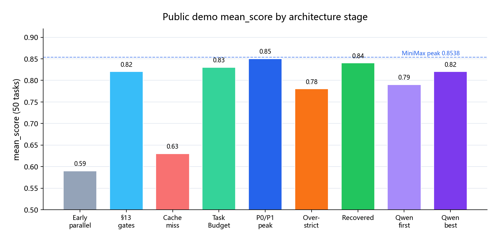
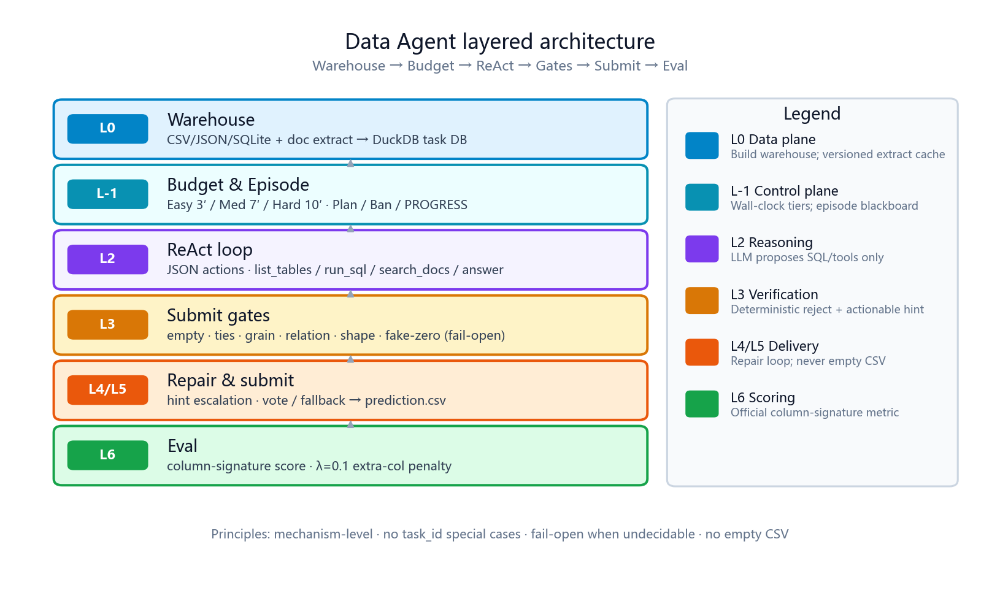
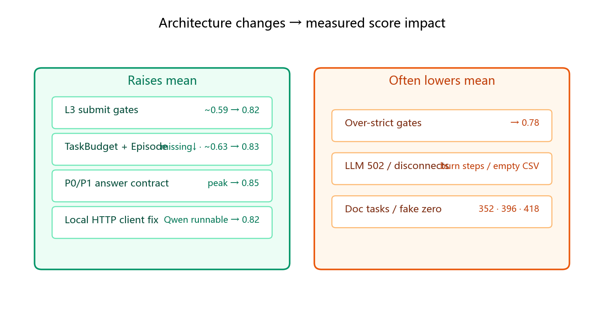
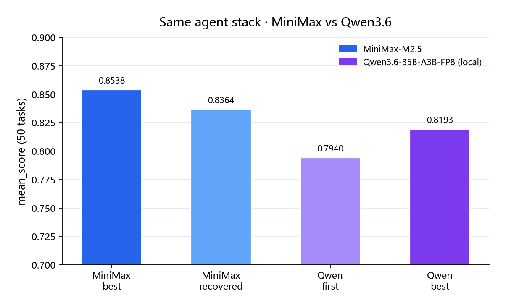

<div align="center">

# DataAgent-Bench Starter Kit

English | [中文](README.zh.md)

[](https://dataagent.top)
[](https://drive.google.com/file/d/1c6u5WlFw4KV7CBRyXh5BvFYbKqxhBSbL/view)
[](https://discord.com/invite/7eFwJQN3Fx)

**KDD Cup 2026 · DataAgent-Bench · Phase 1**

A hardened ReAct data agent: per-task DuckDB warehouse, deterministic L3 submit gates, tiered wall-clock budgets. Works with MiniMax, DeepSeek, Zhipu, and local Qwen via any OpenAI-compatible `/v1` server.

</div>

> Default I/O: read `data/public/input/`, write `prediction.csv` for the official column-signature metric (`λ=0.1`).  
> Mechanisms: [架构设计.md](架构设计.md) (Chinese). Full score history: [RESULTS.md](RESULTS.md).

---

## Highlights

| Item | Value |
| --- | --- |
| Public demo | **50** tasks |
| Best mean (this fork) | **0.8538** · MiniMax-M2.5 · `20261004T181023Z` |
| Best local OSS model | **0.8193** · Qwen3.6-35B-A3B-FP8 · `20261006T035536Z` |
| Submission rate (best) | MiniMax **49/50**; Qwen **50/50** |
| Entry | `uv run dabench <command> --config PATH` |
| Artifacts | `artifacts/runs/<run_id>/` |

<p align="center">
  
</p>

(Representative full runs; exact run IDs / models in the tables below. Regenerate with `python assets/gen_readme_figures.py`.)

---

## Architecture

The agent does **not** answer by reading raw files. Flow: **build warehouse → ReAct SQL probes → deterministic gates → submit**.

<p align="center">
  
</p>

| Layer | Role | Modules |
| --- | --- | --- |
| **L0** | Structured tables + doc extract (complete-or-nothing cache) | `tools/warehouse.py`, `doc_extract.py` |
| **L-1** | Tiered wall-clock, extract/solve reserve, episode blackboard | `run/task_budget.py`, `agents/episode.py` |
| **L2** | JSON ReAct; tools hit the warehouse only | `agents/react.py`, `tools/registry.py` |
| **L3** | Code-only gates; undecidable → pass | `submit_*`, `grain_contract`, `answer_contract` |
| **L4/L5** | Repair escalation; exhaust vote / fallback submit | `react.py`, `voting.py` |
| **L6** | Official column-signature score | `eval/scoring.py` |

Discipline: **mechanism-level rules, no `task_id` special cases; never submit empty CSV; fail-open when evidence is missing.**

---

## Benchmark Results

Metric: public demo **50 tasks**, `score = max(0, recall − 0.1 × extra_cols / pred_cols)`. Missing `prediction.csv` → **0**, still averaged.

### Representative full runs

| Stage | Run ID | Model | Mean | With pred. | Missing | Notes |
| --- | --- | --- | ---: | ---: | ---: | --- |
| Early parallel | `20260923T011119Z` | DeepSeek-family | 0.5867 | 45 | 5 | `workers=8`, unstable |
| §13 gate peak | `20260930T065125Z` | DeepSeek-family | 0.8245 | 49 | 1 | IR / grain / tri-state |
| MiniMax early | `20261002T223024Z` | **MiniMax-M2.5** | 0.6349 | 39 | 11 | Many doc-task missings |
| + TaskBudget / Episode | `20261003T171818Z` | MiniMax-M2.5 | 0.8330 | 49 | 1 | Missing **11→1** |
| Full-submit baseline | `20261004T022019Z` | MiniMax-M2.5 | 0.8324 | **50** | **0** | First 0-missing after budgets |
| **P0/P1 peak** | `20261004T181023Z` | MiniMax-M2.5 | **0.8538** | 49 | 1 | Cutoff / fake-zero / vote / projection |
| Over-strict gates | `20261005T022131Z` | MiniMax-M2.5 | 0.7763 | 48 | 2 | Gate + API jitter |
| After rollback | `20261005T084204Z` | MiniMax-M2.5 | 0.8364 | 49 | 1 | Rolled back over-strict COUNT/HAVING |
| Qwen first full | `20261006T022037Z` | **Qwen3.6-35B** | 0.7940 | **50** | **0** | Fixed empty vLLM 502 |
| **Qwen best** | `20261006T035536Z` | Qwen3.6-35B | **0.8193** | **50** | **0** | Local FP8 OSS model |

### Architecture change → score impact

<p align="center">
  
</p>

| Change set | Problem addressed | Measured impact |
| --- | --- | --- |
| **L3 base gates** | “Runs → submit” semantic errors | DeepSeek full runs ~0.59 → **0.82** (`065125Z`) |
| **Extract cache + rate limits** | 429 / warehouse timeouts / missing spike | Bad cache bump → **0.59** (`072431Z`); warm restores |
| **§14 TaskBudget + Episode** | Doc extract eats wall-clock; empty warehouse thrash | MiniMax missing **11→1**, mean **0.63→0.83** |
| **P0 cutoff / fake-zero / scalar promote** | LIMIT-1 collapse, constant 0, bad promote | Peak **0.8538** (`181023Z`) |
| **P1 voting + sidecar drop** | Wrong exhaust promote; λ extra-col penalty | Same era as P0 |
| **Over-strict undirected COUNT / HAVING-IN** | Stabilize 196/199 | With API jitter → **0.776**; after rollback → **0.836** |
| **Local provider + IPv4 / no-keepalive** | OpenAI SDK → vLLM empty 502 | Qwen from all-zero runs to full **0.79–0.82** |

### Model comparison: MiniMax vs Qwen3.6

<p align="center">
  
</p>

| | **MiniMax-M2.5** | **Qwen3.6-35B-A3B-FP8** (local vLLM) |
| --- | --- | --- |
| Best mean | **0.8538** (`181023Z`) | **0.8193** (`035536Z`) |
| Submissions | Usually 49–50 / 50 | Stable **50 / 50** after adapter fix |
| Strengths | Stronger on hard grain/ratio; higher peak | Self-hosted, no token bill, complete submits |
| Risks | API jitter burns steps | Thinking in `content` / HTTP 502 (mitigated in `model.py`) |
| Config | `provider: minimax` | `provider: local` + `api_base: http://host:port/v1` |

**Shared residual zeros:** `163` (wrong type column), `169` (SUM/12 vs AVG/12; knowledge vs gold), `344/352/396` (sparse docs / extract). Gates **do not adjudicate** knowledge vs gold.

---

## Quick Start

1. Install [`uv`](https://docs.astral.sh/uv/getting-started/installation/):

   ```bash
   curl -LsSf https://astral.sh/uv/install.sh | sh
   ```

2. From `PHASE_1/`:

   ```bash
   uv sync
   ```

3. Place the public demo under `data/public/input/` (gold under `data/public/output/`).

4. Copy config and set the model:

   ```bash
   cp configs/react_baseline.example.yaml configs/react_baseline.yaml
   ```

5. (Recommended) warm extract caches:

   ```bash
   uv run dabench warm-extract-cache --config configs/react_baseline.yaml
   ```

6. Run & score:

   ```bash
   uv run dabench run-benchmark --config configs/react_baseline.yaml
   uv run dabench score artifacts/runs/<run_id> --config configs/react_baseline.yaml
   ```

---

## Configuration

Example: `configs/react_baseline.example.yaml` (local `react_baseline.yaml` is gitignored).

```yaml
dataset:
  root_path: data/public/input

agent:
  provider: local                 # deepseek | minimax | zhipu | openai | local
  model: Qwen3.6-35B-A3B-FP8
  api_base: http://10.x.x.x:8090/v1   # stop at /v1; do not append /chat/completions
  api_key:                        # optional for local
  max_steps: 16
  temperature: 0.0
  strip_think: true

run:
  output_dir: artifacts/runs
  max_workers: 1
  task_timeout_seconds: 0         # 0 = Easy/Med/Hard tiered budgets

eval:
  enabled: true
  lambda_extra: 0.1
```

| provider | Default `api_base` | Notes |
| --- | --- | --- |
| `deepseek` | `https://api.deepseek.com/v1` | Strip `<think>` |
| `minimax` | `https://api.minimax.io/v1` | `reasoning_split` |
| `zhipu` | `https://open.bigmodel.cn/api/paas/v4` | Thinking off by default |
| `local` | `http://localhost:8090/v1` | vLLM/SGLang; IPv4 + no keepalive; disable `enable_thinking` |

---

## CLI

```bash
uv run dabench <command> --config PATH [options]
```

| Command | Purpose |
| --- | --- |
| `status` | Paths / dataset visibility |
| `inspect-task` | Task metadata + context tree |
| `warm-extract-cache` | Serial extract warm-up |
| `run-task` | Single task |
| `run-benchmark` | Full suite (`--limit N` optional) |
| `score` | Score an existing run |

---

## Tools

Operate on the **per-task DuckDB warehouse**:

| Tool | Purpose |
| --- | --- |
| `list_tables` | Tables / columns / row counts |
| `run_sql` | Read-only SQL; `final=false` probe, `final=true` answer table |
| `search_docs` | Search `doc/*.md` (not `knowledge.md`) |
| `answer` | Submit last `final=true` result and stop |

Parse / `EXPLAIN` before execute; L3 gates before accept. See [架构设计.md](架构设计.md).

---

## Outputs

```text
artifacts/runs/<run_id>/
├── summary.json
├── scores.csv / scores_summary.json
└── task_<id>/
    ├── trace.json
    ├── prediction.csv      # may be missing → score 0
    └── progress.json
```

---

## Project Layout

| Path | Responsibility |
| --- | --- |
| `agents/react.py` | ReAct loop + gate orchestration |
| `agents/model.py` | OpenAI-compatible adapter (incl. local/vLLM) |
| `agents/answer_contract.py` | Cutoff / fake-zero / sidecars |
| `agents/grain_contract.py` | Unified grain contract |
| `run/task_budget.py` | Tiered wall-clock |
| `run/runner.py` | Single / batch runner |
| `tools/warehouse.py` | DuckDB build |
| `tools/doc_extract.py` | Doc extract + cache |
| `eval/scoring.py` | Official scorer |

---

## Docs

| Doc | Content |
| --- | --- |
| [架构设计.md](架构设计.md) | L0–L6, §13 gates, §14 budgets, P0–P2 |
| [RESULTS.md](RESULTS.md) | Historical runs + changelog |
| [运行说明.md](运行说明.md) | Windows / PowerShell ops (Chinese) |
| [测试文档.md](测试文档.md) | Early DeepSeek round notes (Chinese) |

---

## Contact

- Issues: https://github.com/HKUSTDial/kddcup2026-data-agents-starter-kit/issues  
- Website: https://dataagent.top  
- Discord: https://discord.com/invite/7eFwJQN3Fx  
- WeChat: `数据智能与分析实验室 DIAL`

<div align="center">
  <table>
    <tr>
      <td align="center">
        <a href="https://dataagent.top">
          
        </a><br />Official Website
      </td>
      <td align="center">
        <a href="https://discord.com/invite/7eFwJQN3Fx">
          
        </a><br />Discord
      </td>
      <td align="center">
        
        <br />WeChat Official Account
      </td>
    </tr>
  </table>
</div>
