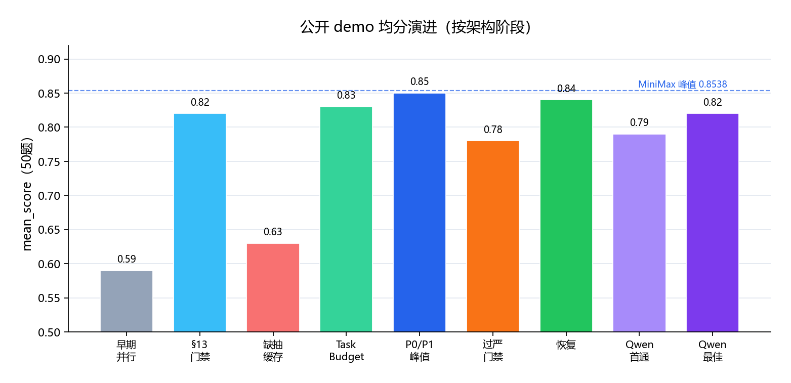
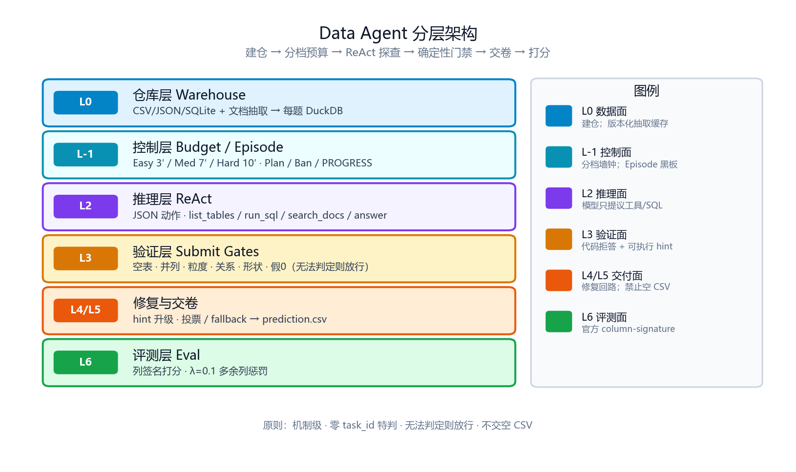
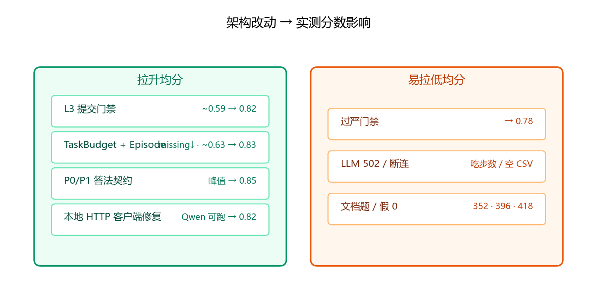
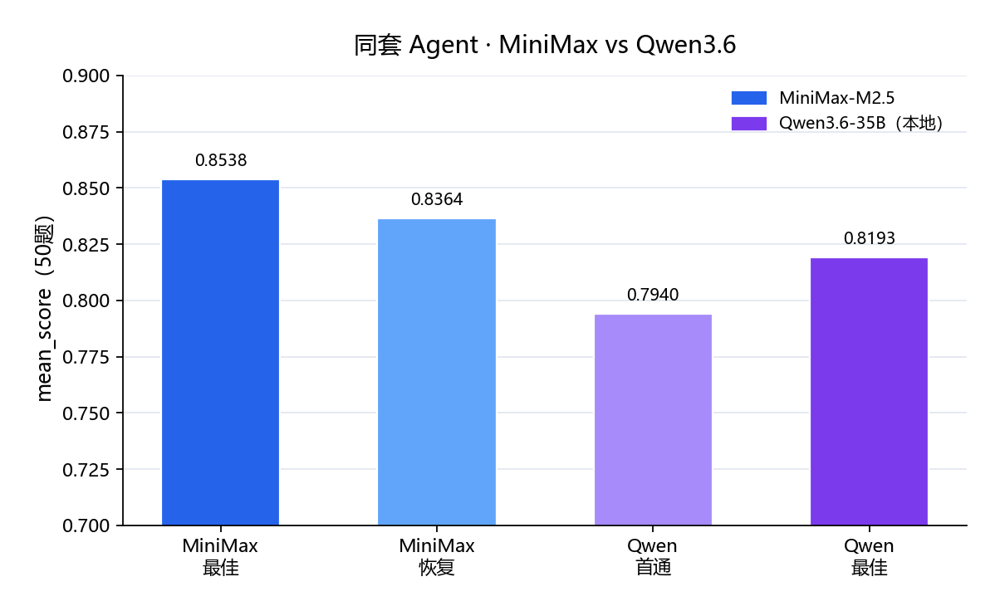

<div align="center">

# DataAgent-Bench Starter Kit

[English](README.md) | 中文

[](https://dataagent.top)
[](https://drive.google.com/file/d/1c6u5WlFw4KV7CBRyXh5BvFYbKqxhBSbL/view)
[](https://discord.com/invite/7eFwJQN3Fx)

**KDD Cup 2026 · DataAgent-Bench · Phase 1**

本地增强版 ReAct Data Agent：每题 DuckDB 仓 + 确定性 L3 门禁 + 分档墙钟，支持 MiniMax / DeepSeek / 智谱 / 本地 Qwen（OpenAI 兼容）。

</div>

> 仓库默认读取 `data/public/input/`，写出 `prediction.csv` 供官方 column-signature 评分（`λ=0.1`）。  
> 详细机制见 [架构设计.md](架构设计.md)；完整跑分曲线见 [RESULTS.md](RESULTS.md)。

---

## Highlights

| 项 | 内容 |
| --- | --- |
| 公开 demo | **50** 题（Easy / Medium / Hard） |
| 最佳均分（本仓库实测） | **0.8538** · MiniMax-M2.5 · `20261004T181023Z` |
| 本地开源模型 | **0.8193** · Qwen3.6-35B-A3B-FP8 · `20261006T035536Z` |
| 交卷率（最佳轮） | MiniMax **49/50**；Qwen **50/50** |
| 入口 | `uv run dabench <command> --config PATH` |
| 产物 | `artifacts/runs/<run_id>/` |

<p align="center">
  
</p>

（柱状为代表性全量 run；精确 run_id / 模型见下文表格。重绘：`python assets/gen_readme_figures.py`。）

---

## Architecture

Agent 不做「直接读文件答题」，而是：**先建仓 → ReAct 探 SQL → 确定性门禁 → 交卷**。

<p align="center">
  
</p>

| 层 | 职责 | 关键模块 |
| --- | --- | --- |
| **L0** | 结构化表 + 文档抽取（complete-or-nothing 缓存） | `tools/warehouse.py` · `doc_extract.py` |
| **L-1** | 分档墙钟、抽取/解题预算、Episode 黑板 | `run/task_budget.py` · `agents/episode.py` |
| **L2** | JSON ReAct；工具只打仓，不直读 context 当答案 | `agents/react.py` · `tools/registry.py` |
| **L3** | 代码判定门禁；无法判定则放行 | `submit_*` · `grain_contract` · `answer_contract` |
| **L4/L5** | 拒绝计数升级 hint；耗尽时投票 / fallback 提交 | `react.py` · `voting.py` |
| **L6** | 官方列签名打分 | `eval/scoring.py` |

设计原则：**机制级、零 `task_id` 特判；不交空 CSV；证据不足 fail-open。**

---

## Benchmark Results

评测：公开 demo **50 题**，`score = max(0, recall − 0.1 × extra_cols / pred_cols)`；缺 `prediction.csv` 记 **0** 并计入平均。

### 代表性全量 run

| 阶段 | Run ID | 模型 | Mean | 有预测 | Missing | 备注 |
| --- | --- | --- | ---: | ---: | ---: | --- |
| 早期并行 | `20260923T011119Z` | DeepSeek 系 | 0.5867 | 45 | 5 | workers=8，质量不稳 |
| §13 门禁峰值 | `20260930T065125Z` | DeepSeek 系 | 0.8245 | 49 | 1 | IR / grain / 三态门禁 |
| 切换 MiniMax 初期 | `20261002T223024Z` | **MiniMax-M2.5** | 0.6349 | 39 | 11 | 文档题大量 missing |
| + TaskBudget / Episode | `20261003T171818Z` | MiniMax-M2.5 | 0.8330 | 49 | 1 | missing 从双位数压到 1 |
| 全交卷基线 | `20261004T022019Z` | MiniMax-M2.5 | 0.8324 | **50** | **0** | 分档墙钟后首次 0 missing |
| **P0/P1 峰值** | `20261004T181023Z` | MiniMax-M2.5 | **0.8538** | 49 | 1 | 截断 / 假 0 / 投票 / 投影 |
| 过严门禁回退 | `20261005T022131Z` | MiniMax-M2.5 | 0.7763 | 48 | 2 | 连同 API 抖动，均值下挫 |
| 回退后恢复 | `20261005T084204Z` | MiniMax-M2.5 | 0.8364 | 49 | 1 | 回退过严 COUNT/HAVING 规则 |
| Qwen 首通全量 | `20261006T022037Z` | **Qwen3.6-35B** | 0.7940 | **50** | **0** | 修通 vLLM 空 502 |
| **Qwen 最佳** | `20261006T035536Z` | Qwen3.6-35B | **0.8193** | **50** | **0** | 本地 FP8 开源模型 |

### 架构改动 → 分数影响

<p align="center">
  
</p>

| 改动批次 | 解决什么 | 对实验结果的影响（可复现 run） |
| --- | --- | --- |
| **L3 基础门禁**（空表 / 并列 / 粒度 / 形状） | 「能跑就交」的语义错 | DeepSeek 全量从 ~0.59 抬到 **0.82**（`065125Z`） |
| **抽取缓存 + 限流** | 429、建仓超时、missing 暴涨 | 缓存错误 bump 曾打到 **0.59**（`072431Z`）；预热后恢复 |
| **§14 TaskBudget + Episode** | 文档题抽完没时间交；空仓空转 | MiniMax missing **11→1**，mean **0.63→0.83**（`223024Z`→`171818Z`） |
| **P0 截断 / 假 0 / 标量 promote** | LIMIT1 收窄、常量 0、错 promote | 在 §14 之上再抬到 **0.8538**（`181023Z`） |
| **P1 投票 + sidecar 列裁剪** | 耗尽交错表、多交旁证列 λ 惩罚 | 与 P0 同阶段；extra-col 题部分回升 |
| **过严对称 COUNT / HAVING-IN** | 本意稳住 196/199 | 与连网抖动叠加 → **0.776**（`022131Z`）；回退后回到 **0.836** |
| **Local provider + IPv4/no-keepalive** | OpenAI SDK→vLLM 空 body 502 | Qwen 从「整 run 0 分」变为可交卷全量 **0.79–0.82** |

### 模型对比：MiniMax vs Qwen3.6

<p align="center">
  
</p>

| | **MiniMax-M2.5** | **Qwen3.6-35B-A3B-FP8**（本地 vLLM） |
| --- | --- | --- |
| 最佳 mean | **0.8538**（`181023Z`） | **0.8193**（`035536Z`） |
| 交卷 | 通常 49–50 / 50 | 稳定 **50 / 50**（适配器修好后） |
| 优势 | 复杂 grain / 比值题更稳，峰值更高 | 自托管、无按量计费、交卷完整 |
| 风险 | API 抖动占步数 → missing / 乱交 | thinking 占 `content`、HTTP 502（已在 `model.py` 兜底） |
| 配置 | `provider: minimax` | `provider: local` + `api_base: http://host:port/v1` |

**共性残差（两模型仍常 0 分）：** `163`（type 字段选错）、`169`（SUM/12 vs AVG/12，knowledge 与 gold 冲突）、`344/352/396`（文档残表 / 抽取）、部分比值与临床区间题。门禁**不替 gold 裁决**公式权威。

---

## Quick Start

1. 安装 [`uv`](https://docs.astral.sh/uv/getting-started/installation/)：

   ```bash
   curl -LsSf https://astral.sh/uv/install.sh | sh
   ```

2. 进入 `PHASE_1/` 并安装依赖：

   ```bash
   uv sync
   ```

3. 准备公开 demo 数据到 `data/public/input/`（标准答案在 `data/public/output/`）。

4. 复制配置并填写模型：

   ```bash
   cp configs/react_baseline.example.yaml configs/react_baseline.yaml
   ```

5. （推荐）预热抽取缓存：

   ```bash
   uv run dabench warm-extract-cache --config configs/react_baseline.yaml
   ```

6. 跑分：

   ```bash
   uv run dabench run-benchmark --config configs/react_baseline.yaml
   uv run dabench score artifacts/runs/<run_id> --config configs/react_baseline.yaml
   ```

---

## Configuration

`configs/react_baseline.example.yaml`（本地 `react_baseline.yaml` 已 gitignore，勿提交密钥）。

```yaml
dataset:
  root_path: data/public/input

agent:
  provider: local                 # deepseek | minimax | zhipu | openai | local
  model: Qwen3.6-35B-A3B-FP8
  api_base: http://10.x.x.x:8090/v1   # 填到 /v1，不要带 /chat/completions
  api_key:                        # local 可空
  max_steps: 16
  temperature: 0.0
  strip_think: true

run:
  output_dir: artifacts/runs
  max_workers: 1
  task_timeout_seconds: 0         # 0 = Easy/Med/Hard 分档墙钟

eval:
  enabled: true
  lambda_extra: 0.1
```

| provider | 默认 `api_base` | 说明 |
| --- | --- | --- |
| `deepseek` | `https://api.deepseek.com/v1` | 剥 `<think>` |
| `minimax` | `https://api.minimax.io/v1` | `reasoning_split` |
| `zhipu` | `https://open.bigmodel.cn/api/paas/v4` | 默认可关 thinking |
| `local` | `http://localhost:8090/v1` | vLLM/SGLang；IPv4 + 关 keepalive；关 `enable_thinking` |

---

## CLI

```bash
uv run dabench <command> --config PATH [options]
```

| 命令 | 作用 |
| --- | --- |
| `status` | 路径 / 数据集可见性 |
| `inspect-task` | 单题元信息与 context 树 |
| `warm-extract-cache` | 串行预热文档抽取 |
| `run-task` | 单题 |
| `run-benchmark` | 全量（可 `--limit N`） |
| `score` | 对已有 run 打官方分 |

---

## Tools

面向**每题 DuckDB 仓**（不是直接把 context 文件当答案）：

| 工具 | 作用 |
| --- | --- |
| `list_tables` | 表 / 列 / 行数 |
| `run_sql` | 只读 SQL；`final=false` 探查，`final=true` 存答案表 |
| `search_docs` | 检索 `doc/*.md`（不搜 knowledge） |
| `answer` | 提交最近 `final=true` 结果并结束 |

执行前 parse / `EXPLAIN`；提交前经 L3 门禁。详见 [架构设计.md](架构设计.md)。

---

## Outputs

```text
artifacts/runs/<run_id>/
├── summary.json
├── scores.csv / scores_summary.json
└── task_<id>/
    ├── trace.json
    ├── prediction.csv      # 可能缺失 → 该题 0 分
    └── progress.json
```

---

## Project Layout

| 路径 | 责任 |
| --- | --- |
| `agents/react.py` | ReAct 主循环、门禁编排 |
| `agents/model.py` | OpenAI 兼容适配器（含 local/vLLM） |
| `agents/answer_contract.py` | 截断 / 假 0 / sidecar |
| `agents/grain_contract.py` | 粒度契约统一入口 |
| `run/task_budget.py` | 分档墙钟 |
| `run/runner.py` | 单题 / 批量调度 |
| `tools/warehouse.py` | DuckDB 建仓 |
| `tools/doc_extract.py` | 文档抽取与缓存 |
| `eval/scoring.py` | 官方列签名打分 |

---

## Docs

| 文档 | 内容 |
| --- | --- |
| [架构设计.md](架构设计.md) | L0–L6、§13 门禁、§14 预算、P0–P2 映射 |
| [RESULTS.md](RESULTS.md) | 历史 run 表、changelog |
| [运行说明.md](运行说明.md) | Windows / PowerShell 实操 |
| [测试文档.md](测试文档.md) | 早期 DeepSeek 分轮记录 |

---

## Contact

- Issues：https://github.com/HKUSTDial/kddcup2026-data-agents-starter-kit/issues  
- 官网：https://dataagent.top  
- Discord：https://discord.com/invite/7eFwJQN3Fx  
- 微信公众号：`数据智能与分析实验室 DIAL`

<div align="center">
  <table>
    <tr>
      <td align="center">
        <a href="https://dataagent.top">
          
        </a><br />官方网站
      </td>
      <td align="center">
        <a href="https://discord.com/invite/7eFwJQN3Fx">
          
        </a><br />Discord
      </td>
      <td align="center">
        
        <br />微信公众号
      </td>
    </tr>
  </table>
</div>
