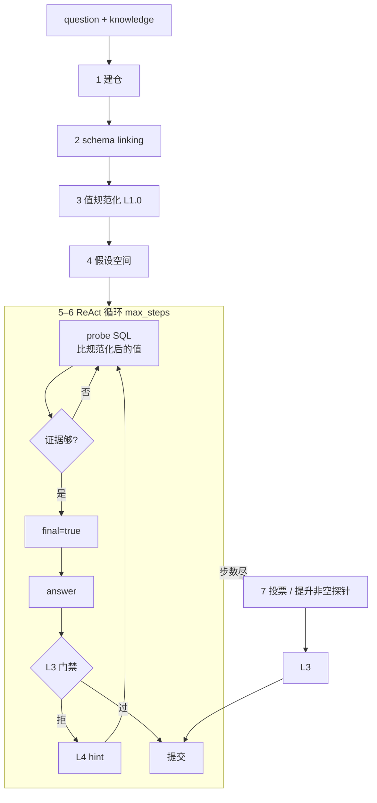

# Data Agent 架构设计文档

版本：2026-09-30（修订：§13.8 三门禁 + §13.8d 触发面收窄）
基线：`20260924T095853Z` mean 0.757
近期对照：`20260930T065125Z` **0.8245** / `20260930T084543Z` 0.8144 / `20260930T034747Z` 0.8133 / `20260929T103145Z` 0.7933
目标：在 50 题公开集上稳定超过 0.80，且规则可迁移、不按单题硬编码。

---

## 0. 七步主流程（现行）

不做题型硬分类。主链路是 **模式链接 → 值规范化 → 假设 → 证据 → ReAct 多轮 → 门禁 → 投票兜底**：

```
1 建仓 L0          doc_extract + DuckDB（串行抽取 / 缓存复用 / 正式名仲裁）
2 分析锚定 L0.5    schema linking：question+knowledge → 候选表/列 + 歧义组（软）
3 值规范化 L1.0    题面字面量 ↔ 列样本 ↔ knowledge 单位：解析→截断→再比较（已实现）
4 假设生成 L1.5    竞争解释：列歧义 / 同名跨表 / 粒度 / 度量身份 / 谓词作用域 / 时间精度 / list vs scalar（软）
5 探查验证         ReAct run_sql(probe)：在规范化后的值上验证；空探查 → 改谓词/粒度
6 生成 SQL         run_sql(final=true) 锁定答案表；证据够则必须收敛
7 校验+多轮+兜底   L3 门禁 → L4 hint；步数尽则投票 / 提升非空探针候选 → prediction.csv
```



| 原则 | 含义 |
|---|---|
| Prompt 软 / 代码硬 | 候选与假设只进提示；空表/形状/歧义未探查等由门禁拦截 |
| **对齐语义值，不对齐字符串** | `0:01:54` / `1:54` / `1:54.455` 先规范化再比较；禁止把字面 `=` 当唯一完成条件 |
| 不缩题型 | 不用「这是 COUNT 题」一类硬模板；形状门禁只在高置信信号时触发 |
| ReAct 仍是引擎 | 假设-验证嵌在循环里，不是替代多轮；**证据够了必须交，不许无限精确化** |

实现入口：`agents/schema_link.py` · `agents/value_normalize.py` · `agents/hypothesis.py` · `agents/sql_ir.py` · `agents/predicate_scope.py` · `agents/measure_identity.py` · `agents/voting.py` · `agents/react.py` · `agents/submit_validation.py`。

---

## 1. 问题定义

本系统的本质是：**给定自然语言问题 + knowledge.md + 多源数据（CSV/JSON/SQLite/叙述文档），生成并执行 SQL，提交结果表**。

已定位的失败分多类（按修复位置归类）：

| 类别 | 代表任务 | 根因 | 修复位置 |
|---|---|---|---|
| 数据缺失 / 命名污染 | 379（TR450）、349（Business→general Business） | 抽表不完整或正式名被形容词覆盖 | L0 数据治理 |
| 粒度选错 | 25（早期） | 粗/细粒度未强制 | L3 粒度契约（已实现） |
| 度量身份 | 25（`065125Z` 仍 0） | 题面 *cost* 被换成同袋 *spent*；knowledge 的 SUM(spent) 被当成 cost | L1.5/L3 度量身份（§6.4.12 / §13.8c，已实现） |
| 成员扩张 | 199 | 丢掉筛选表后按组键展开 | L3 |
| 关系重复计数 | 196 | 未 COUNT(DISTINCT rel_id) | L3 |
| 答法形状错误 | 200（COUNT 被明细覆盖）；180 曾多交 ID | 能跑就交，未锁提交形态 | L3 形状门禁（已实现） |
| 谓词作用域 | 180（无护栏除法）、249（单列 IS NOT NULL 连坐） | WHERE 改写了题未许可的人口 | L1.5/L3（§6.4.11 / §13.8b，已实现） |
| 字段歧义（列名不同） | 86（round vs position） | 一词多列未双探 | L0.5/L3 歧义门禁（已实现） |
| 字段歧义（同名跨表） | 80（`drivers.number` vs `qualifying.number`） | 列名相同，门禁按叶子名去重放行 | L0.5/L3（§6.4.10 / §13.8a，已实现） |
| **语义值未对齐 / 查到不交** | **80**（`0:01:54` vs `1:54.455`） | 字面等值当完成条件；粗粒度已命中仍不 `final` | **L1.0 规范化 + L2 收敛（已实现）** |
| API/限流空转 | 055612Z 后半程 12 题 missing | 429 仍打满 16 步 | L2/L4 硬停（已实现） |
| 题目/gold 歧义 | 163、169、396 | 题面与 gold 冲突 | 不修，接受 0 分 |

核心教训：

1. **提示词是建议，代码才是约束。**
2. **用假设空间 + 证据收敛，不用硬编码题型盒子。**
3. **迭代修 SQL 必须：检测 → 分类 → 定向 hint → 按类计数上限；禁止无分类的漫游重写。**
4. **比较的是规范化后的语义值，不是题面字符串；证据够了必须提交，不许无限「再精确一点」。**

---

## 2. 总体架构

```
┌─────────────────────────────────────────────────────────────┐
│  L0 数据治理层  doc_extract + warehouse                       │
│     抽表 → 正式名仲裁 → 完整性报告 → DuckDB                    │
├─────────────────────────────────────────────────────────────┤
│  L0.5 模式链接  schema_link（候选表/列/歧义组，软锚定）         │
├─────────────────────────────────────────────────────────────┤
│  L1.0 值规范化  value_normalize（语义值对齐；已实现）           │
├─────────────────────────────────────────────────────────────┤
│  L1 / L1.5 探查 + 假设  hypothesis + evidence_guidance         │
│     值域 / 连接 / 极值 / 歧义列双探 / 粒度对比                   │
├─────────────────────────────────────────────────────────────┤
│  L2 生成层  ReAct + SQL 生命周期                              │
│     草稿 SQL → parse/EXPLAIN → execute →（失败回修复）         │
│     证据够 → 必须 final+answer；禁止精确化空转                  │
├─────────────────────────────────────────────────────────────┤
│  L3 验证层  执行前 + 执行后确定性门禁                           │
│     空结果 · 极值 · 粒度 · 成员 · 歧义未探 · 关系 · 形状 · 范围 │
├─────────────────────────────────────────────────────────────┤
│  L4 修复层  错误分类 → 定向 hint → 按类重试计数 → 上限停        │
│     含：429/限流硬停；不引入 Draft/Refine 额外模型轮次           │
├─────────────────────────────────────────────────────────────┤
│  L5 提交层  投票选最优 final；可提升非空探针候选 + 列裁剪       │
├─────────────────────────────────────────────────────────────┤
│  L6 评估层  单题验证 → 全量回归 → diff → 复盘                   │
└─────────────────────────────────────────────────────────────┘
```

### 2.1 SQL 迭代修复闭环（核心数据流）

系统不是「一次生成 SQL 就交」，而是受控闭环：

```
模型产出 SQL
    │
    ▼
[执行前] parse / EXPLAIN          ←── 语法、表名列名、明显绑定错误
    │ 失败
    └────────► L4 分类 hint ──► 模型改 SQL（该类 ≤ N 次）──► 回到执行前
    │ 成功
    ▼
[执行] run_sql（probe 或 final）
    │ 运行时错误
    └────────► L4 分类 hint ──► 改写（≤ N）──► 回到执行前
    │ 成功
    ▼
[执行后] L3 结果/形状校验
    │ 失败（空表、粒度、形状……）
    └────────► L4 分类 hint ──► 改写（≤ N）──► 回到执行前
    │ 成功
    ▼
answer → L5 列裁剪 → prediction.csv
```

与「模型自己迭代」的本质区别：

| | 漫游重写 | 本架构闭环 |
|---|---|---|
| 谁发现错 | 模型猜 | parse / EXPLAIN / L3 **代码判定** |
| 怎么改 | 自由重写（易漂） | **按错误类给固定 hint** |
| 何时停 | 常不停 | **每类计数 + max_steps + 限流硬停** |

EXPLAIN 通过 ≠ 逻辑正确；逻辑只能靠 L3 的保守校验（形状、空表、粒度等）。没有 gold 时不做「逻辑正确性证明」。

数据流向：context/ → L0 → 落盘 DuckDB → L1/L2 循环（含执行前检查）→ L3 →（失败回 L4/L2 / 成功进 L5）→ L6。

---

## 3. L0 数据治理层

### 3.1 为什么需要数据治理层

数据治理层是整根管线的地基。它的输入是任务上下文中的原始文件（CSV、JSON、SQLite、叙述文档），输出是 DuckDB 中可被 SQL 查询的表。如果这一层出错，下游 SQL 写得再漂亮也是垃圾进垃圾出。

在文本到表的抽取场景中，常见错误有三类：

1. **遗漏实体**：文档里有的记录没抽出来（task_379 的 TR450）。
2. **字段污染**：后文别名或描述覆盖了前文的正式值（task_349 的 "Business" 被改成 "General Business"）。
3. **冲突未仲裁**：同一实体在多个段落出现不同版本，合并时没有统一规则。

这些错误之所以难被发现，是因为模型只能看到最终表，看不到抽取过程。因此治理层必须自己产出**质量报告**，让下游知道哪些表可信、哪些表只是下界。

### 3.2 设计目标

| 目标 | 含义 | 否则会怎样 |
|---|---|---|
| 完整性可验证 | 能发现原文里有但表里没有的实体 | 聚合结果变成下界 |
| 一致性可仲裁 | 多段落冲突有确定规则 | 同一行出现前后矛盾值 |
| 不可破坏性修复 | 修复过程不能引入新错误 | 字段回填把正确值改错 |
| 质量可报告 | 每张表附带置信度说明 | 模型在残表上硬算 |
| 版本可复现 | 缓存与代码版本绑定 | 改了逻辑还用旧缓存 |

### 3.3 通用设计原则

**原则 1：来源即真理（Source text is ground truth）**

所有抽取结果都必须能回溯到原文段落。当结果与原文冲突时，以原文为准。这不是因为原文永远对，而是因为原文是外部可审计的唯一事实来源。

**原则 2：主键是完整性的锚点**

没有主键的表无法做完整性校验。schema 推断时应优先把文档中的注册号、ID、唯一名称设为主键。主键是后续「原文扫描补漏」的基础。

**原则 3：后文不覆盖前文的官方值**

同一实体在多个段落出现时，常见模式是「最初列为 X，后来订正为 Y」。合并规则是：
- 空值可以被非空值覆盖。
- 已有非空值**不被后文覆盖**，除非后文明确是「官方 / finalized / corrected」且前文明确是「initially / previously / listed as」。
- 形容词性描述（如 General、Former）永远不能覆盖正式名称。

这条原则直接阻止了 task_349 的回归：「General Business」不应覆盖「Business」。

**原则 3b：Registry / 官方句式优先于形容词短语（已实现）**

叙述文档常见「The program for Business (Registry ID: …)」与后文「the general Business program」。正式名取自 **Registry 句式中的专名**；“general / former / foundational” 等修饰语不得写入名称列。knowledge 中若出现该实体的正式称呼，与抽取冲突时以 knowledge 为准。实现：`doc_extract.apply_registry_official_names`（`_EXTRACT_VERSION=4`）。

**原则 4：无法验证时要显式标注不确定性**

不是所有文档都能做原文扫描（例如短数字主键、纯描述性段落）。这时治理层不应假装完整，而应在质量报告中标注 `key_scannable: false`，让下游知道这张表有潜在遗漏风险。

**原则 5：缓存必须版本化（已细化）**

抽取依赖大模型，结果不稳定。缓存可以省钱省时间，但缓存键必须包含代码版本号。当**LLM 侧**抽取逻辑（prompt、schema 推断）改变时，版本号提升，旧缓存自动失效。

细化（已实现）：确定性后处理（如 Registry 正式名仲裁）**不**提升版本号，而是在加载旧缓存（≥`_MIN_CACHE_VERSION=1`）时重放后处理并以当前版本回写——改进后处理不再迫使全量重抽（429 环境下这是建仓超时的主因）。配套：`doc_extract.EXTRACT_CONCURRENCY` 默认串行（`DATA_AGENT_EXTRACT_CONCURRENCY` 可调）、`EXTRACT_CALL_DELAY_SECONDS` 逐次限速（`DATA_AGENT_EXTRACT_DELAY`，默认 0.5s）；`OpenAI` 客户端硬超时 60s、`max_retries=1`（`DATA_AGENT_LLM_TIMEOUT` / `DATA_AGENT_LLM_MAX_RETRIES`）；`cli warm-extract-cache` 在跑分前串行预热全部抽取缓存，使计分运行的建仓退化为纯本地 IO。

### 3.4 实施方案

#### 3.4.1 Schema 推断

对每份叙述文档，先采样若干段落让模型推断 schema：
- 列名优先来自 `knowledge.md`，避免每份文档各起一名。
- 主键优先选注册号、分子 id、病人 id 等稳定标识符。
- 不要发明文档里没有的指标列。

#### 3.4.2 段落级抽取

每个段落独立抽取成一行。这一步的目的是高召回：宁可多抽几行，后续按主键合并；也不要因为段落理解困难就漏掉实体。

#### 3.4.3 按主键合并

对同一主键的多行做合并：
```python
if value and not merged[col]:
    merged[col] = value
```
即只有当前值为空时，才用新值填充；已有非空值不会被后文覆盖。这是原则 3 的工程实现。

#### 3.4.4 完整性校验

合并后生成 `ExtractionReport`：

```python
@dataclass
class ExtractionReport:
    stem: str
    row_count: int
    key_scannable: bool           # 主键是否能在原文中安全扫描
    missing_keys: list[str]       # 原文出现但表中没有的主键
    empty_field_cells: int        # 空字段单元格总数
    field_fill_rate: dict[str, float]  # 每列非空率
```

生成 `missing_keys` 的方法：
1. 从已抽取主键归纳模式（如 `TR391` → 前缀 `TR` + 数字）。
2. 用泛化正则扫描全文，列出所有符合该模式的主键值。
3. 与已抽取主键集合求差集。

边界：主键是 1–2 位纯数字时，泛化正则会大量误匹配，因此不做扫描，`key_scannable=false`。

#### 3.4.5 定向补抽（不覆盖）

若 `missing_keys` 非空，只对包含这些主键的段落重新抽取，生成 stub 行后再次合并。补抽只填空字段，不覆盖已有非空字段。

#### 3.4.6 质量报告注入 Schema

治理层把 `ExtractionReport` 传给 L1 探查层。schema 文本中会出现：

```
Table: molecule (from doc/molecule.md) — EXTRACTION INCOMPLETE:
  3 source keys missing from table (e.g. TR450).
  Treat aggregates over this table as lower bounds.
```

这让模型在写 SQL 前就知道数据缺陷，避免在残表上做精确比较或聚合。

### 3.5 边界情况处理

| 边界情况 | 处理策略 | 原因 |
|---|---|---|
| 文档无主键 | 不做完整性扫描，仅报告行数；schema 中标注「无唯一键」 | 没有锚点就无法判定遗漏 |
| 短数字主键 | `key_scannable=false`，不扫描原文 | 误匹配率过高 |
| 同一字段多段落冲突 | 已有非空值不覆盖；只有当前为空时才合并 | 防止别名/描述污染正式值 |
| 抽取模型返回无效 JSON | 跳过该段落，不影响其他段落 | 单点失败不破坏整体 |
| 缓存版本与代码不一致 | LLM 侧逻辑变更才提升 `_EXTRACT_VERSION`；后处理变更在加载时重放（≥v1 缓存直接复用） | 保证一致性的同时避免无谓重抽（429 下重抽=建仓超时） |
| 正式名 vs「general X」 | Registry 句式中的专名优先；修饰语不入库 | 避免 349 类污染 |

---

## 4. L1 探查层

### 4.1 为什么需要探查层

大模型写 SQL 时最大的幻觉来源是：它以为知道数据长什么样，其实不知道。常见幻觉包括：

1. **编码幻觉**：把 `"severe"` 当成 `"most severe"`，或把 `"Business"` 当成 `"General Business"`。
2. **连接幻觉**：以为两张表能一对一连接，实际只有 3% 的行匹配。
3. **极值幻觉**：用 `ORDER BY ... LIMIT 1` 找最低值，不知道有 5 行并列最低。
4. **粒度幻觉**：把行级最小值和分组最小值当成一回事。

这些错误本质上是把**语义推断**当成**数据事实**。探查层的职责就是：在生成最终 SQL 之前，用廉价的查询把关键事实固化下来，让模型基于观察结果写 SQL，而不是基于想象。

### 4.2 设计目标

- **可观察性**：把「列里有什么值」「表间多少行匹配」「极值有多少行」变成显式 observation。
- **低成本**：探查查询必须是 `COUNT / DISTINCT / LIMIT` 类轻量查询，不能全表扫描大列。
- **可被下游使用**：探查结果要进入提示词，也要被 L3 验证层引用。
- **协议化**：哪些情况必须探查，要写成明确规则，不能靠模型自觉。

### 4.3 通用设计原则

**原则 1：先观察，后查询**

模型在看到以下信息之前，不应写带过滤条件或 join 的 SQL：
- 过滤列的真实值域（distinct values）。
- 连接键的真实匹配数。
- 聚合目标列的分布（min/max/null 比例）。

这条原则把错误从「写错 SQL」前移到「发现事实」。

**原则 2：关键基数必须显式探测**

任何影响结果行数的操作都必须先探测基数：
- `WHERE col = 'X'` 之前，先确认 `'X'` 在列中存在。
- `JOIN` 之前，先确认两侧连接键的匹配数。
- `GROUP BY` 之前，先确认分组键的基数。

基数探测不依赖语义，只看 `COUNT(DISTINCT)` 和 `COUNT(*)`。

**原则 3：边界值必须确认命中数**

对于 `MIN/MAX` 类问题，必须执行：
```sql
SELECT COUNT(*) FROM t WHERE col = (SELECT MIN(col) FROM t)
```
这能把极值并列问题暴露出来，避免 `LIMIT 1` 截断。

**原则 4：不假设编码与英文同义**

文档中的英文描述（如 "low cost"）和数据库中的编码值（如 `"6"`）不一定对应。探查层要求模型查看 `DISTINCT` 结果，而不是从问题文本中猜值。

**原则 5：探测结果写入上下文**

探测结果进入 `observation`，随对话历史保留。最终提交时，L3 验证层可以引用这些结果判定「成员扩张」「粒度错误」等。

### 4.4 必做探查清单

根据问题的结构，以下探查必须执行：

#### 4.4.1 编码列 distinct 值

当问题或 `knowledge.md` 提到某个分类列时，探测其所有 distinct 值（大表可 LIMIT + COUNT）：
```sql
SELECT category, COUNT(*) FROM events GROUP BY category ORDER BY category
```

#### 4.4.2 连接键匹配数

多表 join 前，探测两侧匹配基数：
```sql
SELECT COUNT(DISTINCT a.id), COUNT(DISTINCT b.a_id), COUNT(*) FROM a JOIN b ON a.id = b.a_id
```

如果匹配数极低，说明 join 条件可能写错或数据稀疏，需要显式处理。

#### 4.4.3 极值命中数

最低/最高问题必须先探测：
```sql
SELECT MIN(cost), MAX(cost), COUNT(*) FILTER (WHERE cost = (SELECT MIN(cost) FROM t)) FROM t
```

#### 4.4.4 时间/日期范围与格式

当问题含时间条件时，探测该列的 min/max 和典型格式：
```sql
SELECT MIN(event_date), MAX(event_date), COUNT(*) FROM events
```

#### 4.4.5 NULL / 空值比例

过滤列若含大量 NULL，会导致结果异常缩小。探测：
```sql
SELECT COUNT(*), COUNT(col), COUNT(*) - COUNT(col) AS nulls FROM t
```

#### 4.4.6 聚合粒度样本

对于 lowest/highest 问题（以及 knowledge 里带 `SUM(` 公式的 average），必须探测两种粒度：
- **细粒度**：行级 `MIN/MAX/AVG`。
- **粗粒度**：`SUM/GROUP BY` 后再聚合。

示例：
```sql
-- fine
SELECT MIN(cost) FROM event_lines
-- coarse
SELECT event_id, SUM(cost) FROM event_lines GROUP BY event_id
```

#### 4.4.7 歧义属性多候选探查（列名不同 + 同名跨表）

当问题中的一个名词能对上 schema 里多个列时，候选身份一律是 **`表.列`**，不是叶子列名：

| 子类 | 例 | 说明 |
|---|---|---|
| 列名不同 | 86：`position` / `round` / `positionOrder` | 同义词袋 |
| **同名跨表** | 80：`drivers.number` vs `qualifying.number` | 叶子名相同，实体命名空间不同 |

探查协议：

1. 列出候选（列名、同义词袋、或同名跨表），不做单题硬编码。
2. 对每个 **`表.列`** 各跑一次带该过滤的探查。`FROM qualifying … number` **不算** 探过 `drivers.number`。
3. 仲裁见 §13.4 / §13.8a：knowledge 映射 → 题面点名的实体表上的同名列 → 少 join。

禁止在提示词里写死「track number = position」或「his number = drivers.number」。协议见 `prompt.py` 规则 18b。

### 4.5 探查结果的使用方式

1. **进入提示词**：每次 `run_sql` 返回的 observation 包含 row_count、distinct values、min/max/hit count，模型在下一次思考中引用。
2. **被验证层引用**：L3 的成员一致性检查会比较「探查阶段的小结果集」和「最终 SQL 的结果集」。
3. **被拒绝时作为证据**：当最终 SQL 违反探查发现的事实时，拒绝 observation 中附带探查结果，让模型有据可依地修改。

### 4.6 边界情况处理

| 边界情况 | 处理策略 | 原因 |
|---|---|---|
| distinct 值过多 | 只返回前 N 个 + 总数，不返回完整列表 | 避免 observation 过长 |
| 探查结果与 knowledge 冲突 | 优先相信探查结果，并在提示词中标注冲突 | knowledge 也可能是示例或旧版 |
| 多列共同编码 | 探测组合 distinct，如 `SELECT DISTINCT a, b` | 单列 distinct 会丢失组合信息 |
| 稀疏 join | 报告匹配率，模型应确认是否用 INNER JOIN 丢弃不匹配行 | 避免 LEFT JOIN 扩大结果 |
| 时间列格式混乱 | 报告 sample 和 min/max，提示使用 `TRY_CAST` | 减少格式错误 |
| 探查超时 | 降低 LIMIT，先返回样本而非全量统计 | 不能因为探查卡住整个任务 |

### 4.7 L1.0 值规范化层（语义对齐，已实现）

#### 4.7.1 为什么需要这一层

模式链接解决「用哪张表/哪一列」；探查解决「列里有什么」。还缺一层：**题面里的值** 与 **库里存的值** 常常意思相同、写法不同。

典型失败（`task_80`，`20260930T034747Z`）：

| 来源 | 值 | 说明 |
|---|---|---|
| 题面 | `0:01:54` | H:MM:SS |
| knowledge | `MM:SS.mmm` | 官方时间单位 |
| 真实数据 | `1:54.455` / `1:54.960` | M:SS.mmm |

语义上：`0:01:54` = `01:54` = `1:54`（1 分 54 秒）；毫秒是题面未给出的更细维度，比较时应省略。

**探查第 3 步已用粗粒度命中 2 行；第 18 步已 join 出车手号码 3 与 5。** 失败原因不是「没查到」，而是 L2 把「字符串精确等于题面」当成完成条件，拒绝用已对齐的语义值交卷，随后退回 `q3 = '0:01:54'` 空转直至步数尽。

本质缺口：

1. **没有规范化**：一直在比字符串，不比「截到题面粒度后的秒数」。
2. **停步条件是软的**：§8「exactly」/§10「禁止 fuzzy」压过 §24「按题面粒度截断」；模型认为 `1:54.455 ≠ 0:01:54` → 还没答完。
3. **代码不强制收敛**：非空粗粒度命中 ≠ 必须 `final`；L5 兜底只要 `final=true`，探针结果抬不上去。

#### 4.7.2 设计目标

| 目标 | 含义 | 否则会怎样 |
|---|---|---|
| 语义对齐 | 比较规范化后的值，不比较原始字符串 | `0:01:54` 永远匹配不上 `1:54.455` |
| 题面定粒度 | 题面更粗时，把存储值截断到题面精度再比 | 把近似命中当成「猜错了」继续空转 |
| 可迁移 | 时间 / 日期 / 单位共用「解析→截断→比较」 | 为每题写 LIKE 补丁 |
| 不生硬拒答 | 规范化是工具与引导，不是「格式不对就拒」的硬门禁 | 误杀本来正确的精确匹配题 |
| 与假设层衔接 | `time_granularity` 等假设用规范化结果证伪/确认 | 假设永远停在软提示 |

#### 4.7.3 通用流程（先对齐，再比较）

```
题面字面量 ─┐
knowledge 单位/格式 ─┼─► parse（解析为规范量）
列样本 DISTINCT ────┘         │
                              ▼
                    按题面粒度 truncate / round
                              │
                              ▼
                    等值比较（可多行并列）
                              │
                              ▼
                    命中 → 锁定谓词 → final + answer
```

| 题面 | 库里 | 规范化后（题面粒度） |
|---|---|---|
| `0:01:54` | `1:54.455` | 均为 **1 分 54 秒**（丢毫秒） |
| `1:54` | `1:54.960` | 同上 |
| `2024-03` | `2024-03-15` | 均为 **2024-03**（截到月） |
| `100cm` | `1.00`（m） | 先统一单位再比 |

同义写法（须同一语义桶）：`0:01:54` / `00:01:54` / `01:54` / `1:54`。

#### 4.7.4 与模糊匹配的边界（刻意不做的）

| 做 | 不做 |
|---|---|
| 同一度量、不同书写 / 不同精度 | 近邻模糊（「最接近的一行时间」） |
| knowledge 声明的单位换算 | 无单位依据的随意缩放 |
| 题面粒度截断后的多行并列全交 | 因题面单数（the driver）而 `LIMIT 1` 砍并列 |

「意思相同、表述不同」指 **可解析的同度量对齐**，不是编辑距离或 embedding 相似。

#### 4.7.5 落地位置（机制，非题号）

| 位置 | 行为 |
|---|---|
| **L1.0 模块**（`agents/value_normalize.py`） | 从 question 抽候选字面量；结合 knowledge 格式提示，产出：解析后的规范量、题面粒度、建议 SQL 谓词模板（如 `LIKE '1:54%'` / floor seconds） |
| **task prompt / observation** | 软注入 normalize 块 + 粗粒度命中后硬提示「禁止退回精确等值；下一步 final=true」 |
| **L2 收敛** | `consecutive_exact_empty` 与无关 DISTINCT 解耦；粗粒度非空后 observation 强制收敛 |
| **L5 兜底** | 无 `final=true` 时，`find_promotable_probe` 提升相关非空探针（去 LIMIT）再走 L3 |

#### 4.7.6 验收与反例

- 正例：题面时间粗于存储列，粗粒度探针非空 → 在步数内提交；并列多行不全砍。
- 反例（禁止）：按 `task_80` 写死 `LIKE '1:54%'`；或规定「凡是时间题一律模糊」。
- 回归：单题 80；全量 diff 确认精确匹配题不倒退。

---

## 5. L2 生成层（ReAct 循环）

### 5.1 为什么需要生成层

探查层只负责把数据事实摆上台面；真正把「问题 + knowledge + 观察结果」变成可执行 SQL 的，是生成层。这一层必须存在，是因为：

1. **问题不是 SQL**：自然语言到 SQL 没有唯一映射，需要多轮试探、纠错、收窄。
2. **一次写对几乎不可能**：编码、连接、粒度、时间单位任一环节猜错，结果就错；必须允许「跑一下 → 看 observation → 再改」。
3. **工具边界必须清晰**：模型不能直接读文件、不能手写答案行，只能通过受控工具操作仓库。否则会绕过 L0/L1 的事实约束。

生成层的本质是一个**受工具约束的推理循环**，不是「一次 prompt 出最终 SQL」。

### 5.2 设计目标

| 目标 | 含义 | 否则会怎样 |
|---|---|---|
| 可迭代 | 模型能基于 observation 改写 SQL | 第一次写错就只能交白卷 |
| 可约束 | 只能用规定工具，不能贴行、不能出仓 | 答案脱离仓库、无法评分 |
| 可迁移 | 提示词只写通用原则，不写单题补丁 | 过拟合 50 题，换集即崩 |
| 可结束 | 有明确的 final → answer 终止协议；**证据够时强制收敛** | 无限探查或「查到不交」 |
| 可修复 | 被 L3 拒绝后，步数预算内仍能改 | 拒绝一次就耗尽步数 |

### 5.3 通用设计原则

**原则 1：Thought → Action → Observation 闭环**

每一步必须产出一个可解析的动作（`list_tables` / `run_sql` / `answer`），并消费上一步 observation。不允许「只思考不行动」，也不允许跳过 observation 连写多条 SQL。

**原则 2：探查与提交分离**

- 探查：`run_sql(final=false)`，结果可被 LIMIT 截断，仅用于观察。
- 提交：`run_sql(final=true)` 存下完整结果表，再 `answer` 提交。
- 禁止把 probe LIMIT 的结果当最终答案，也禁止在 `answer` 里手写行。
- **补充（L1.0）**：探针在题面粒度上非空命中后，下一步应把**同一谓词**写成 `final=true`，而不是改回更严的字面等值。探针是待提升的候选，不是废稿。

这条原则保证评分用的是完整表，而不是截断样本。

**原则 2b：证据够了必须交（防「查到不交」）**

完成条件是「规范化后的谓词已命中」，不是「库中字符串等于题面原文」。

- 粗粒度 / 规范化探针非空后，禁止连续多步再跑同一字面量的精确等值空查询。
- 题面单数（the / his）但命中多行：按并列全交，不因「看起来不像唯一答案」而拒交。
- 提示词冲突时：**L1.0 语义对齐优先于「字面 exactly」**（exactly 约束的是编码/阈值，不是未对齐的时间字符串）。

**原则 3：提示词只写机制，不写实例**

提示词可以写：
- 「极值并列要返回全部」
- 「extremum（及 knowledge 含 SUM 的 average）要探双粒度」
- 「时间粒度比列粗时先舍入再比较」

提示词不可以写：
- 具体任务 id、具体列名、具体字面量（如 `1:54`、`Meeting`）
- 「这道题应该用某某公式」

机制进提示词，实例进代码检查。否则每次修一题都会污染全局。

**原则 4：knowledge 是编码与公式的权威，不是可粘贴的成品 SQL**

knowledge 里的示例 SQL 只是模式。生成层必须先核对 `list_tables`：示例里的表/列若不存在，就 join 真正有该列的表，或忽略该示例。

**原则 5：步数是稀缺资源**

`max_steps` 有限（默认 16）。探查、被拒、重写都消耗步数。因此：
- 尽早做必做探查（见 L1），不要无效全表 dump。
- L3 拒绝必须附带「下一步做什么」，否则模型会原地打转直到超时。
- **兜底提交（已实现）**：若循环结束仍无 answer，但 session 里已有 `final=true` 的结果，则合成一次 `answer` 走完整 L3 门禁；通过则提交，拒绝则仍记 max_steps 失败。只提交模型自己算过的结果，不编造。

**原则 6：异常不能静默吞掉推理轨迹**

模型调用、解析、工具执行中的异常必须记入 step（含异常类型）。`MemoryError` 这类 `str(exc)==""` 的异常尤其要记类型名，否则会出现「steps 为空、错误原因为空」的假初始化失败。

### 5.4 实施方案

#### 5.4.1 循环结构

```
准备 knowledge 文本 + schema 文本
for step in 1..max_steps:
    model.complete(messages) → JSON {thought, action, action_input}
    若 action == run_sql:
        执行前：parse / EXPLAIN（失败 → L4 hint，不落库执行）
        执行：probe 或 final
        执行后：仅 final 路径在 answer 时做 L3 全量门禁
    若 action == answer:
        L3 门禁 → 通过则 L5 提交；失败则 L4 hint
    把 observation 追加进对话
    若 is_terminal → 结束
    若连续 API 429 / 用量耗尽 → 立即结束本任务（不打满 max_steps）
若无 answer 且 session 有 last_final → 兜底提交（走 L3）；失败则记 max_steps
```

入口：`agents/react.py`。工具注册：`tools/registry.py`。

#### 5.4.2 SQL 生命周期（执行前检查）

每次 `run_sql` 在真正取数前：

1. **只读断言**：已有（禁止写库、禁止出仓读文件）。
2. **parse / prepare**：让 DuckDB 解析语句；失败则返回语法/对象错误，不执行。
3. **EXPLAIN**（推荐）：`EXPLAIN <sql>` 暴露绑定与计划错误；失败同样走 L4，不计入「逻辑校验通过」。

注意：EXPLAIN 成功只说明「能计划」，不说明「答对了题」。

#### 5.4.3 工具集合

| 工具 | 作用 | 约束 |
|---|---|---|
| `list_tables` | 再次查看表结构 | 通常 schema 已在任务消息中，仅需补查时调用 |
| `run_sql` | 只读 SQL：先 parse/EXPLAIN，再执行 | `final=false` 探查；`final=true` 存答案表；可选 `grain=fine\|coarse` |
| `answer` | 提交最近一次合规 final 结果 | 禁止粘贴行；需通过 L3 |

#### 5.4.4 提示词内容边界

保留的通用原则（`agents/prompt.py`）：
- 精确键连接，稀疏 join 丢弃不匹配行
- 双粒度探查（fine / coarse）：extremum 必做；裸 average 默认不做，除非 knowledge 有 `SUM(`
- 极值并列、聚合成员一致性、关系表 `COUNT(DISTINCT id)`
- 时间/日期：问题粒度比列粗时，先舍入到问题粒度再比较
- 单指标题只选一列；姓名拆 `first_name`/`last_name`

禁止进入提示词：任务 id、具体值、单题特判正则。

#### 5.4.5 步数与终止

- `max_steps=16`：覆盖「探查 + EXPLAIN 失败重写 + 提交 + 被拒重写」。
- 剩余步数 ≤ 2 时，observation 附加催促：有结果就 `answer`。
- 正常终止：`run_sql(final=true)` → L3 通过 → `answer` → `is_terminal`。
- 异常终止：步数耗尽、任务超时、MemoryError、**连续 429/额度耗尽硬停**。

#### 5.4.6 与上下游的接口

- **吃 L0/L1**：schema（含抽取警告）+ knowledge + observation。
- **喂 L3**：SQL 文本、结果表、trace。
- **吃 L3/L4**：拒绝 observation；模型只负责改 SQL，不负责「发明新检查」。

### 5.5 边界情况处理

| 边界情况 | 处理策略 | 原因 |
|---|---|---|
| 模型输出非 JSON / 多段文本 | 解析失败记 `__error__` step，不中断整个 benchmark | 单步失败可重试 |
| 模型把答案行写进 action_input | `answer` 忽略手写行，只交 final SQL 表 | 防止绕过仓库 |
| 只探查不提交 | 步数将尽时催促 `final`+`answer`；L1.0 命中后硬提示收敛；仍无 final 则 L5 可提升相关非空探针 | 防止「查到不交」 |
| 被拒后重复同一 SQL | 由 L4 修复计数器升级 hint，最终放行 | 避免死循环超时 |
| knowledge 很长 | 整文件能放就全放；否则按标题切段做 token 重叠检索 | 保真优先于摘要 |
| 仓库 OOM / 硬错误 | 记录 error_type，停止循环；仓库落盘并在任务结束清空 | 保护进程与后续任务 |
| API 429 / 用量上限 | 连续出现即结束本任务，failure_reason 标明 rate_limit | 避免打满 16 步空烧额度 |
| 精确等值连续空、粗粒度已非空 | 记「粒度未收敛」类 hint，禁止再换回题面原文字面量 | task_80 类 |

---

## 6. L3 验证层（核心）

### 6.1 为什么需要验证层

生成层的输出不可信：模型可以写出语法正确但语义错误的 SQL，而提示词里的原则只是**建议**。实践中反复出现的失败模式是：

1. **空结果当答案**：谓词写错，0 行也提交。
2. **极值被 LIMIT 截断**：5 行并列最低，只交了 1 行。
3. **粒度选错**：该行级 MIN 却交了按实体 SUM 后再比。
4. **成员扩张**：按学区均值筛出 6 所学校，最终却展开成全区 57 所。
5. **关系重复计数**：无向边存成两行，`COUNT(*)` 翻倍。
6. **离谱数值**：百分比算出 150。
7. **答法形状错误（重点补充）**：题目要一个总数，却在算对 COUNT 后又提交明细行（task_200）；题目只要消费状态，却多交 CustomerID（task_180）。

前六类是「结果能不能交」；第七类是「**交出来的形状是否配得上这道题**」。没有形状门禁，系统就是「能跑就尽量交」。

验证层职责：把提示词建议升级为提交前门禁——过不了门就不能 `answer`。

### 6.2 设计目标

| 目标 | 含义 | 否则会怎样 |
|---|---|---|
| 确定性 | 同一 trace + SQL → 同一判定，不调模型 | 检查本身漂移 |
| 可解释 | 拒绝必须带 error + 可操作 hint + 证据字段 | 模型原地乱改 |
| 保守拦截 | 无法判定时放行 | 误杀导致超时/回归 |
| 机制级 | 规则针对失败模式，不针对单题 | 无法迁移 |
| 可计数 | 同类拒绝可被 L4 累计，防止死循环 | 同一检查刷爆步数 |
| 形状约束 | 题型规定允许的结果形态 | COUNT 被明细覆盖仍得 0 分 |

### 6.3 通用设计原则

**原则 1：代码判定，模型不参与**

验证层只读：最终 SQL 文本、结果表、step trace、warehouse 统计、knowledge 原文。不发起新的 LLM 调用。需要「理解题意」才能判的，一律不进 L3（留给提示词或接受丢分）。

**原则 2：无法判定则放行**

例如粗粒度检查提不出 `SUM(col)` 的列名时，返回 `None`（放行），而不是拒绝。误放行损失一轮分数；误拒绝可能耗尽步数让整题变 0，且拖垮跑分时间。

**原则 3：拒绝必须附带下一步**

```json
{
  "ok": false,
  "error": "哪条检查失败",
  "hint": "下一步具体改什么 / 用哪个已探查结果",
  "<check_name>_check": { "...证据..." }
}
```

`hint` 写「不要再用 LIMIT 1，改成 WHERE col = (SELECT MIN(col) ... )」这类可执行指令；禁止只写「请再想想」。

**原则 4：证据来自已发生的执行，不来自题面猜测**

成员扩张检查比较的是「探查步的行数/表集合」与「最终 SQL 的行数/表集合」，不解析「Riverside」是不是地名。关系对称检查是对仓库跑 `GROUP BY rel_id HAVING COUNT(*) > 1`，不猜表语义。

**原则 5：检查顺序由便宜到昂贵、由硬到软**

执行前：parse / EXPLAIN。  
执行后：空结果、极值并列 → 粒度/成员/关系 → **答法形状** → 常识范围。  
任一拒绝即停，不叠多条，避免 hint 互相矛盾。

**原则 6：题型锁形状，不锁具体 SQL 文本**

问 calculate / how many / total / percentage 时，允许的结果是「单列、通常单行的标量」；不允许在已有合规标量 final 之后，再用多列明细覆盖提交。这是机制约束，不是 `if task_200`。

### 6.4 检查项与实施方案

#### 6.4.1 空结果拒绝

- **触发**：最终表 0 行。
- **动作**：拒绝；附带最终 SQL 涉及列的 min/max/count。
- **hint**：谓词若越界则放宽或删除该条件，再 `final=true`。
- **位置**：`submit_rows.submit_row_rejection`。

#### 6.4.2 极值并列被 LIMIT 截断

- **触发**：开放极值题（lowest/highest…，且非 top-N / 唯一胜者）；最终 SQL 带尾部 LIMIT；去掉 LIMIT 后行数更大。
- **动作**：拒绝。
- **hint**：改为 `WHERE col = (SELECT MIN/MAX(col) FROM ...)`，返回全部并列行。
- **位置**：同上。

#### 6.4.3 双粒度必须都探过

- **触发**：题目含 lowest/highest 等 extremum；裸 average/mean **不开**，除非 knowledge 出现 `SUM(`。trace 中 fine 与 coarse 未同时出现。成员扩张用独立触发 `wants_member_expansion_check`（仍含 average）。
- **动作**：在 `answer` 前拒绝（尚未提交表）。
- **hint**：补探缺失粒度（可 `grain=fine|coarse`），比较后再选。
- **位置**：`aggregate_grain.dual_grain_satisfied`。

#### 6.4.4 粗粒度提交需 knowledge 授权

- **触发**：双粒度都已探过，最终 SQL 仍是 coarse，且能从 `SUM(col)` 抽出度量列，且 knowledge 未定义该列的粗公式。
- **放行条件**：knowledge 明确定义了该度量列的粗公式。
- **三态（§13.5）**：`measure_col is None`（无法判定）不再是静默放行，而是 **UNDECIDED**——放行但记遥测（`gate_telemetry["grain_undecided"]`），并在 `run_sql final=true` 成功时提前给模型软提示（`pre_submit_grain_notes`）。
- **IR（§13.1）**：判定前统一过 `normalize_sql`，带引号标识符（`SUM(e."cost")`）不再绕过 measure 抽取。
- **fine 证据锚定（§13.3）**：`MIN(spent)` 这类列画像探针不再冒充 fine——fine 要求 MIN/MAX/AVG 作用于题面锚定的列。
- **hint**：改交已探过的 fine 路径。
- **位置**：`aggregate_grain.submit_grain_rejection`（经 `grain_contract.submit_grain_contract_pre` 调用）。
- **教训**：曾经在 `measure_col=None` 时也拒绝，导致模型卡死超时；现已改为无法判定则放行。

#### 6.4.5 成员一致性（防扩张）

- **触发**：trace 中存在「GROUP BY + HAVING」且行数很小（≤10）的探查；最终 SQL 不再引用这些探查用过的表；最终行数显著大于探查成员数（如 > 5×）。
- **动作**：拒绝。
- **hint**：最终结果应是通过聚合过滤的那批成员，不要丢掉筛选表后按组键回更宽的表展开。
- **位置**：`submit_validation.submit_membership_rejection`（经 `grain_contract.submit_grain_contract_post` 调用）。
- **不依赖**：题面语义；只依赖 SQL 文本与行数。

#### 6.4.5b 同表成员扩张（199 模式，§13.2）

- **背景**：6.4.5 要求 final「丢掉」探查表才触发；199 的 final 仍引用 `frpm`（过滤条件留在子查询里、按学区 HAVING、外层展开全区学校），从缝里漏过去。
- **触发**（全部同时成立）：题目含 extremum/average 词（`wants_member_expansion_check`，与双粒度解耦）；存在「GROUP BY + 聚合」探查且行数 ≤ 10 且与 final 共享至少一张表；final 行数 > max(10, 5×探查行数）；final **外层**查询没有自己的 HAVING（用 `strip_subqueries` 剥掉子查询后判定）。
- **动作**：拒绝。
- **hint**：若聚合条件描述的是输出行本身（「平均 > 400 的学校」），应在输出粒度上 `GROUP BY <输出实体> HAVING <条件>`；只有题目明确要「组成员」时才展开。
- **误伤保险**：正确答案行数小（不触发）；在输出粒度上 HAVING 的正确 final（不触发）；确实要列成员的题最多被误拦 3 次，随后 L4 升级放行。
- **位置**：`submit_validation.submit_member_expansion_rejection`。

#### 6.4.6 对称关系去重（已修：DISTINCT 放行）

- **触发**：最终 SQL 含 `COUNT`；FROM/JOIN 中的表在仓库里存在关系 id 列，且同 id 出现多次。
- **放行**：SQL 已含 `COUNT(DISTINCT <rel_id>)`（含 `CASE … THEN bond_id` 形式）→ 不拒。
- **动作**：否则拒绝。
- **hint**：对关系 id 使用 `COUNT(DISTINCT rel_id)`，不要 `COUNT(*)`。
- **位置**：`submit_validation.submit_symmetric_relation_rejection`。

#### 6.4.7 常识范围（保守）

- **触发**：单行单列数值结果；SQL 含 percent / `* 100` 等；值 ∉ [0, 100]。
- **动作**：拒绝。
- **不做**：金额绝对值、计数、多行结果——避免误杀。
- **位置**：`submit_validation.submit_sanity_rejection`。

#### 6.4.8 答法形状锁定（已实现，对应 200 / 180）

**标量题（calculate / how many / total / percentage）**

- **触发**：题型判定为单标量；当前 final 不是「单列 +（通常）单行数值」，或 trace 中已有合规标量 final，又被多列明细 final 覆盖。
- **动作**：拒绝覆盖；hint 交回已成功的 COUNT/聚合 final，或只 SELECT 度量列。
- **不做**：把所有明细查询都禁掉——探查阶段仍允许明细。
- **位置**：`submit_validation.submit_shape_rejection`。

**状态/度量题（consumption status、给出 xx 情况）**

- **触发**：题型只要度量；最终表含明显实体键列（`*id`、`customer_id` 等）且同时含度量列。
- **动作**：拒绝或强制裁到度量列；不确定则放行（保守）。
- **位置**：`submit_validation.submit_id_column_rejection`。

#### 6.4.9 执行前 parse / EXPLAIN（已实现）

- **触发**：任意 `run_sql`。
- **动作**：解析或 EXPLAIN 失败 → 不执行取数，返回错误类型 `sql_parse` / `sql_explain` + 原错误文本。
- **位置**：`tools/warehouse.explain_sql_plan` → `execute_sql` 入口；`registry._run_sql` 写入 `*_check`。

#### 6.4.10 同名跨表歧义（已实现，对应 80 的 *number*）

- **背景**：6.4 列歧义门禁原先按**叶子列名**判定「是否探过」。`FROM qualifying WHERE number = …` 会让 `\bnumber\b` 同时命中 `drivers.number` 与 `qualifying.number`，整组被标成已探查，门禁下班。这不是 L1.0 时间规范化问题（80 还有另一条时间精度线）。
- **触发**：L0.5 同名组（≥2 张表、叶子列名相同、题面 token 命中该名）仍有 **未以 `表.列` 身份探过** 的成员。
- **不进组**：叶子名为 `id` / `uuid` / `guid` 的纯主键（250 类：每张表都有 `Id`，互探会误杀对 SQL）。带前缀的 `driverId` / `postId` 仍进组。
- **L0.5 软排序（不是拒绝）**：题面命中某表「除该叶子外」的事件列（q3/year/date…）→ 该表标为过滤表、同名列降权；另一张升权为投影列。分差不够 → 不改分。事件叶（q3/time 等）**不再整叶跳过**，打平则 fail-open。
- **knowledge 锚（软）**：knowledge 同时点名 `rank` 与 `positionOrder` 时，题面唯一一侧（`ranked` vs `finishing position`）给对应列 +2.5；两侧都有或都无 → 不加分。L3 仍只要求探过，不锁交哪一列。
- **动作**：拒绝；hint 列出未探的 `table.column`。
- **UNDECIDED**：SQL 无法解析出 `from_tables` 时放行并记遥测（`ambiguity_undecided`）。
- **位置**：`schema_link._build_ambiguity_groups`（A）· `hypothesis._homonym_interpretations`（B）· `submit_validation.submit_ambiguity_probe_rejection`（C）。机制全文 §13.8a / §13.8d。

#### 6.4.11 谓词作用域（已实现，对应 180 / 249）

- **背景**：180 的 `Amount > 0`、249 的 `Age IS NOT NULL` **不是幻觉**，是 LIMIT 预览或 CAST 报错后的自救。病根是 **WHERE 改写了题未许可的统计人口**。这不是 L1.0（值怎么写），是 **谓词作用域**（过滤加在哪一层、覆盖哪些行）。
- **触发 A（除法定义域）**：SQL 含 `/` 或 `DIVIDE`；除数是**裸列**（非聚合、无 NULLIF）；题面/knowledge **未**给出该列的正值/非零前提。
- **触发 B（多度量人口许可）**：≥2 个 AVG/SUM 度量；WHERE 含 `IS NOT NULL` / `!= ''` / 空串修剪，且谓词列 **不是** 当前聚合列；题面/knowledge **未**把「两者都非空」定为人口。
- **动作**：拒绝；hint 分别指向 `NULLIF(denom, 0)` 或「只规范化当前度量列 / 分两次 AVG 再组合」。
- **UNDECIDED / 放行**：无除法、单度量、谓词只绑当前聚合列、knowledge 已授权人口 → 不拒。
- **位置**：`predicate_scope.submit_predicate_scope_rejection`（`react.answer` 在 sanity 之后调用）。机制全文 §13.8b。

#### 6.4.12 度量身份（已实现，对应 25 的 cost vs spent）

- **背景**：dual-grain + 同义词袋「各探一次」解决的是 **没探到**。25 在 `065125Z` 上两条路都探了，仍交 `SUM(spent)`。根因是 **度量身份被同袋列替换**：题面点名 *cost*，knowledge 另有 `SUM(spent)` 公式，模型把公式当成 cost 的定义。这不是探针不准，是 **仲裁缺失**。
- **触发**：schema 存在与题面单词**字面同名**的数值列；final 聚合的是**另一列**（同袋或 knowledge 公式列）；knowledge **没有**「题面词 = 该列」且带 SUM/AVG/MIN/MAX/DIVIDE 的句子。
- **动作**：拒绝；hint 改回题面列（25：`MIN(cost)` 行级；`SUM(cost)` 仍受粒度门禁约束）。
- **放行**：exact 列不存在；或 knowledge 把题面词绑到 final 所用列。
- **位置**：`measure_identity.submit_measure_identity_rejection`。机制全文 §13.8c。

### 6.5 在提交路径中的位置

```
run_sql
  → parse / EXPLAIN（失败 → L4，不执行）
  → execute

answer
  → 是否有 final SQL？
  → 双粒度是否满足？（仅 extremum，或 average 且 knowledge 有 SUM(）
  → 粗粒度是否被 knowledge 授权？
  → 取结果表
  → 空结果 / 极值并列？
  → 成员一致性？
  → 对称关系？
  → 答法形状？
  → 常识范围？
  → 同名跨表 / 列歧义是否按 表.列 探过？
  → 谓词作用域（除法定义域 / 多度量人口）？
  → 度量身份（题面列 vs 同袋替换）？
  → 列裁剪（L5）
  → 真正提交
```

任一门禁失败：返回拒绝 observation，`is_terminal=false`，进入 L4 计数后由模型改 SQL。

### 6.6 边界情况处理

| 边界情况 | 处理策略 | 原因 |
|---|---|---|
| 检查所需信息不足（无 measure_col、无 HAVING 探查） | 放行 | 避免误杀 |
| 同一检查连续触发 | L4 累计；第 2 次升级 hint，第 4 次放行 | 防止超时死循环 |
| hint 与模型理解不一致 | hint 写具体 SQL 形态，不写抽象形容词 | 降低再拒概率 |
| 题目本身歧义 / gold 与数据冲突 | 不在 L3 特判凑分 | 保持机制可迁移 |
| 检查本身抛异常 | 视为无法判定，放行（外层可记日志） | 验证层不能比模型更脆 |
| 多检查同时可触发 | 只返回第一条 | 避免互相矛盾的修复指引 |

---

## 7. L4 修复层

### 7.1 为什么需要修复层

只有拒绝没有修复指引，模型会原地打转；只有重试没有分类，会变成更贵的随机重写（Draft/Refine 已验证会漂移）。修复层把「失败 observation」变成「可执行的下一步」，并用计数器保证收敛。

### 7.2 设计目标

- 每类错误有固定策略与 hint 模板。
- 同类错误有限次（建议 ≤2～3）；超限则放行当前最优或停止，避免超时。
- 不新增额外 LLM 调用轮次；改 SQL 仍由主 ReAct 循环完成。
- 限流/额度类错误不占用「逻辑重试」预算，直接硬停。

### 7.3 通用设计原则

**原则 1：分类重试，不总次数糊弄**

使用 `repair_counts[error_type]`，而不是「总共再试 5 次随便改」。

**原则 2：hint 随次数升级**

- 第 1 次：说明失败原因 + 具体改法。  
- 第 2 次：明确「不要重复上一次 SQL 结构」。  
- 第 3/4 次：放行或停（按检查危险程度选择）。

**原则 3：代码指出错，模型只改一句 SQL**

不在 L4 用规则引擎自动重写整句 SQL（易写死、难迁移）。

**原则 4：基础设施错误与逻辑错误分流**

| 类型 | 行为 |
|---|---|
| 429 / 用量上限 | 立即结束任务 |
| MemoryError | 立即结束任务 |
| sql_parse / sql_explain / 空结果 / 形状… | 计入 repair_counts，继续循环 |

### 7.4 错误分类与策略

| 错误类型 | 来源 | 修复策略 | 建议上限 |
|---|---|---|---|
| rate_limit | 模型 API | 硬停，不重试 | 1 |
| sql_parse / sql_explain | 执行前检查 | 对照 schema 改表名/列名/CAST | 2 |
| sql_runtime | DuckDB 执行异常 | 返回原错误文本 | 2 |
| empty | L3 空结果 | 附 min/max，放宽谓词 | 2 |
| tie | L3 极值并列 | 改为 WHERE col = (SELECT MIN/MAX…) | 2 |
| grain | L3 粒度 | 交另一粒度已探查 SQL | 2 |
| membership | L3 成员 | 回到筛选表成员集 | 2 |
| relation | L3 关系 | COUNT(DISTINCT rel_id) | 2 |
| shape | L3 形状 | 交回标量 final / 去掉 ID 列 | 2 |
| sanity | L3 范围 | 检查分子分母 | 2 |

### 7.5 实施方案

- **已有**：`AgentRuntimeState.repair_counts`；同类拒绝第 4 次放行（`react._maybe_reject`）。
- **待补**：执行前 parse/EXPLAIN 错误写入同一计数体系；429 硬停；形状类 `shape_check` 接入。
- **不做**：自动 SQL 重写器；Draft/Refine 多模型轮次。

### 7.6 边界情况

| 边界 | 策略 |
|---|---|
| 两类错误交替出现 | 各自计数；总步数仍受 max_steps 限制 |
| hint 模型仍不听 | 升级文案 → 超限放行/停；靠 L5 多数表决兜底 |
| 空重试 empty_retries | 调试阶段建议 0，避免 429 题被二次空烧 |

---

## 8. L5 提交层

### 8.1 职责

在 L3 通过后，做列级收尾与（可选）多运行聚合。

### 8.2 现状与方向

- `prune_answer_columns`：按题推断列，**不确定就保留**——对 180/200 偏软，形状门禁应前移到 L3。
- `select_majority_answer`：多次运行按列签名表决——对 86 类模型方差题有效，可保留为可选增强（`empty_retries`/多 attempt），不是主修复手段。
- **投票兜底**（已实现）：多 `final=true` 时按启发式选优再走 L3。
- **探针提升**（待落地，配合 L1.0）：全程无 `final`、但存在与题面规范化谓词相关的非空探针时，将该 SQL 重跑为 `final=true` 再提交。仍须过 L3；不是发明答案行。

### 8.3 原则

L5 不负责发现逻辑错误；发现错误是 L3 的事。L5 只做「通过门禁后的打包」，以及在模型未锁定 final 时的**有证据兜底**（有探针/有 final 才交，无证据不交）。

---

## 9. L6 评估层

**职责**：每次改动可度量、可回归。

### 9.1 实施方案

**E6-1 单题验证先行**：规则落地后先跑受影响题，再全量。

**E6-2 任务级 diff**：`eval/diff_runs.py` 对比两 run 的 score 与触发检查。

**E6-3 复盘归档**：全量后写 `复盘.md`（改动、预期、实际 diff、去留决定）。

**E6-4 区分「无效跑分」**：若大量 missing 且 trace 为 429，该 run **不得**用作「改动无效」的结论（见 `20260929T055612Z`）。

---

## 10. 设计约束（长期有效）

1. 能代码判定的规则不进提示词；提示词不写具体任务、列名、值。
2. 检查无法判定时放行，不做过度拦截。
3. 拒绝必须附带可操作的下一步；按错误类计数，禁止无分类死循环。
4. 数据问题在数据层修；正式名/Registry 句式优先于形容词短语。
5. gold 与题目/数据冲突的题，接受 0 分，不写规则去凑。
6. 每次改动：单题验证 → 全量回归 → 复盘归档。
7. 迭代修 SQL = parse/EXPLAIN → execute → L3 → L4 分类重试；不是模型自由重写。
8. 限流/OOM 硬停，不占满 max_steps。
9. **值比较先规范化再等值**；禁止用题号特判 LIKE / 硬编码时间串。
10. **语义对齐 ≠ 近邻模糊**：不做「最接近的一行」；题面粒度截断后的多行并列全交。

---

## 11. 已完成项（截至 2026-09-29）

| 项目 | 位置 | 状态 |
|---|---|---|
| 粗粒度拒绝收紧（measure_col=None 放行） | `aggregate_grain.py` | 已完成 |
| 禁用字段回填覆盖 | `doc_extract.py` | 已完成（349 仍可能因首抽/缓存为 general Business） |
| 时间粒度通用原则 | `prompt.py` | 已完成 |
| 成员一致性 / 关系去重 / 常识范围 | `submit_validation.py` | 已完成 |
| 完整性报告进 schema | `doc_extract` + `warehouse` | 已完成 |
| 修复计数器 | `runtime` + `react` | 已完成 |
| 落盘 warehouse + 跑完清空 | `warehouse.py` + `runner.py` | 已完成 |
| 异常类型/traceback 记录 | `runner.py` / `react.py` | 已完成 |
| diff 脚本 | `eval/diff_runs.py` | 已完成 |

**未完成（构成本文下一步计划）**：阶段 D 回归（需确认 API 额度后跑单题/全量）；A3 确认额度。

**已落地（代码）**：A1 配置默认、A2 429 硬停、B1 EXPLAIN、B2 形状锁定、B3 ID 列抑制、B4 repair_counts、C1 Registry 正式名、C2 歧义列探查协议。

---

## 12. 下一步执行计划

### 12.1 目标与原则

- 近期目标：在 API 额度可用前提下，mean 稳定超过 **0.80**（`20260930T034747Z` 已达 0.8133，需稳住并修回退）。
- 只做机制级改动；不修 163/169/396。
- 每个改动：单题 → 小集 → 全量 diff → 复盘。
- 25/199/243 回退复盘的架构级产物（五个手段 + 合入纪律）见 **§13**。

### 12.2 假设-验证落地（2026-09-30，已实现）

| 优先级 | 机制 | 模块 | 状态 |
|---|---|---|---|
| P0 | 假设生成 + 证据验证 | `hypothesis.py` → observation guidance | 已实现 |
| P0 | 投票兜底（多 final 选优） | `voting.py` + `_try_fallback_submit` | 已实现 |
| P1 | 模式链接（候选表/列） | `schema_link.py` → task prompt | 已实现 |
| P1 | 假设感知门禁（歧义未双探拒） | `submit_ambiguity_probe_rejection` | 已实现 |
| P2 | knowledge 对齐提示（量级差） | `evidence_guidance` 量级 clash | 已实现（软） |

### 12.3 L1.0 值规范化与「查到不交」收敛（2026-09-30）

| 优先级 | 机制 | 覆盖 | 状态 |
|---|---|---|---|
| P0 | 值规范化模块：parse → 题面粒度截断 → 比较谓词模板 | 80 类时间/日期/单位 | **已实现** `value_normalize.py` |
| P0 | L2：粗粒度非空后禁止退回字面精确等值；硬提示 `final` | 查到不交 | **已实现** `evidence_guidance` |
| P1 | 空探查计数：精确等值空转与「无关非空」解耦 | 80 空转 | **已实现** `consecutive_exact_empty` |
| P1 | L5：无 final 时提升相关非空探针为候选 | missing 且有探针 | **已实现** `find_promotable_probe` |
| P2 | 收窄歧义门禁同义词袋（避免 `type` 绑死所有 `*Type`） | 199 回退 | 待评估 |

设计细节见 **§4.7**；验收单题优先 `task_80`，回归全量对比 `20260930T034747Z`。

### 12.4 已完成的基础设施（阶段 A–C 摘要）

| 项 | 状态 |
|---|---|
| A2 429 硬停 | 已实现 |
| B1 parse/EXPLAIN | 已实现 |
| B2/B3 形状 / ID 列门禁 | 已实现 |
| B4 repair_counts | 已实现 |
| C1 Registry 正式名 + 缓存复用 | 已实现 |
| fallback last_final 提交 | 已实现 |

### 12.5 验证与回归

| 序号 | 任务 | 说明 |
|---|---|---|
| D1 | 单题：`80, 86, 89, 199, 243, 25, 200, 196` | 规范化 / 歧义 / 成员 / 形状 |
| D2 | 全量 50 题 | 对比 `20260930T034747Z` |
| D3 | `diff_runs` + 写 `复盘.md` | 有涨有跌必须解释；429 跑作废重跑 |

### 12.6 明确不做

- 按 task_id / 具体值写死 SQL 或拒绝正则（含为 80 写死 `LIKE '1:54%'`）。  
- 硬编码题型分类模板。  
- 「最接近一行」式近邻模糊匹配。  
- Draft/Refine 多轮自动改写整句 SQL。  
- 为凑 gold 改 163/169/396。  
- 在额度不足时强行全量跑分并解读为「架构无效」。

---

## 13. 架构级优化方向（2026-09-30 评审稿）

> 来源：`20260930T034747Z` 相对 `20260929T103145Z` 的三题回退（25 / 199 / 243）复盘。
> 结论：三题不是三个孤立的 bug，而是**三个通用失效类**的样本。本节给出五个架构层手段，
> 每个手段治一类病、不针对任何单题。合入纪律统一见 §13.5。

### 13.0 为什么不做单题修补

单题补丁（为 25 写死「交行级 MIN」、为 243 写死「分母取投出的票」）有两个硬伤：

1. **过拟合**：公开集对了，私有集同模式换个问法就错；
2. **互相打架**：为 A 题加的正则可能误伤 B 题的门禁输入（25 的门禁就是被一条带引号的 SQL 绕过的）。

因此每个改动必须满足两条才允许合入：

| 纪律 | 含义 |
|---|---|
| 零题目常量 | 判定依据只含结构信号（表/列/粒度/行数），不出现 task_id、具体值、题面原句 |
| 全量无净倒退 | 单题验证 → 全量 A/B diff（§12.5 D1–D3），有涨有跌必须能解释 |

五个手段总览：

| 手段 | 治什么病 | 代表病例 | 落点 | 风险 |
|---|---|---|---|---|
| 一 canonical IR | 门禁被 SQL「表面写法」绕过 | 25（洞1） | L2/L3 接口 | 低 |
| 二 粒度契约 | 聚合粒度 ≠ 题面要求粒度 | 25 + 199 | L1.5 输出 + L3 收敛 | 中 |
| 三 列角色 | 证据分类只看函数名不看列 | 25（洞2） | L0.5 扩展 | 低 |
| 四 解释仲裁 | 语义歧义当场抛硬币 | 243 | L1.5 泛化 | 中 |
| 五 三态 + 纪律 | 门禁「解析失败 = 静默放行」 | 所有门禁 | L3/L6 | 低 |

---

### 13.1 手段一：SQL 规范化中间表示（canonical IR）

**通俗理解**：现在的门禁是「看 SQL 的原始长相」做判断。同一条 SQL 换件马甲——标识符加引号、
换别名、大小写一变——门禁就不认识了。IR 相当于进门先发统一制服：**所有门禁只认制服，不认便装**。

**病例（task_25，0.95 → 0）**：

```sql
-- 103145Z（被门禁拦下，后改对）      -- 034747Z（绕过门禁，交错）
SELECT ... SUM(e.cost)  ...           SELECT ... SUM(e."cost") ...
```

抽取 measure 的正则只认 `SUM(e.cost)`，遇到带引号的 `e."cost"` 提不出列名；
提不出 → 无法判定 → 按 §6.3 原则 2 静默放行 → 粗粒度答案直接交卷。

**机制**：

```
L2 产出 SQL ──► normalize_sql() ──► canonical IR ──► 六个门禁只消费 IR
                   │                   │
                   │                   ├─ 剥离标识符引号 / 反引号："cost" → cost
                   │                   ├─ 统一大小写与空白
                   │                   └─ 别名 → 真表名映射：e."cost" → expense.cost
                   └─ 注意：IR 只用于判定，绝不改写真正执行的 SQL
```

**收益面**：grain、membership、relation、sanity、shape、ambiguity 六个现有门禁
**同时**免疫「表面语法绕过」；未来新门禁直接继承。修一处、护一片。

**风险**：低（纯重构）。唯一注意点：IR 是判定副本，执行链路仍用原始 SQL。

---

### 13.2 手段二：粒度契约（grain contract）

**通俗理解**：25 和 199 看起来像两种病，其实是**同一种病**——
「SQL 在哪个粒度上算」和「题目要哪个粒度」对不上。
现在是两个门卫各管一扇门（dual_grain 管极值、membership 管成员扩张），中间有缝。
粒度契约的做法是：**进门前先申报，门卫只查「申报」和「实际」是否一致**。

**两个病例，一个病根**：

| | task_25 | task_199 |
|---|---|---|
| 题目要的粒度 | 行级：哪几笔 expense 的 cost 最低 | 学校：平均 SAT > 400 的**学校** |
| 模型实际算的 | 按活动 SUM 后再比最低（活动粒度） | 按学区 HAVING 均值，再展开全区学校（学区粒度） |
| 结果 | 交了 Officers meeting（错） | 6 所变 57 所（错） |

**机制**（两步）：

1. **L1.5 hypothesis 显式申报粒度**。假设层本来就要枚举「粒度」竞争解释（§4），
   让它多输出两个结构化字段：

```json
{
  "output_grain": "expense 行（题面：lowest cost）",
  "filter_grain": "无聚合过滤",
  "grain_conflict": ["按 event SUM 后比较"]
}
```

2. **L3 收敛为一个粒度一致性校验**：final SQL 的 `GROUP BY` 键 / `HAVING` 作用对象
   必须落在 `output_grain` 上，否则拒绝。hint 由申报字段自动生成：

```
answer rejected: final SQL aggregates at grain {event}, but the question asks
for grain {expense row}. Rewrite so MIN(cost) is taken at row level.
```

现有 dual_grain、membership 两个门禁**降级为该契约的证据来源**（负责采集探针粒度），
判定逻辑只此一处，不再有缝。

**收益面**：§1 失效表中「粒度选错」「成员扩张」两类合并治理；未来同模式题自动覆盖。

**风险**：中。合并门禁改变触发面，必须走 §12.5 全量回归；误伤保险是「申报缺失时放行」
（契约只在 hypothesis 给出了 output_grain 时生效）。

---

### 13.3 手段三：列角色语义化

**通俗理解**：现在判断「算不算探过细粒度」只看 SQL 里有没有 MIN/MAX/AVG 这几个词，
**不管它量的是什么**。好比只看「手里有没有尺子」，不管量的是桌子还是空气。

**病例（task_25，洞 2）**：

```sql
-- 模型的列画像探针：看看 spent 列的取值范围
SELECT MIN(spent), MAX(spent) FROM expense;
```

这条是**画像探针**（了解列范围），却被证据计数记成「已探过 fine 粒度」
→ dual-grain 前置条件提前满足 → 门禁下班 → 后面的粗粒度提交无人复核。

**机制**：L0.5 的列签名（column-signature）基础设施补一个**角色标注**：

| 角色 | 含义 | 例 |
|---|---|---|
| measure | 可被聚合的数值量 | cost、spent、funding |
| dimension | 分组/筛选用的属性 | event name、district |
| identifier | 主外键 | id、school_code |

证据分类规则升级为：**fine = MIN/MAX/AVG 作用于「与题面锚定相关」的 measure 列**。
画像探针（作用于任意列的范围摸底）自然不再冒充证据。

**收益面**：不止修 25——证据计数、L5 探针提升、hypothesis 收敛提示都消费列角色，
全链路误分类一起减少。

**风险**：低。角色标注失败时退回现有行为（函数名判定），不新增误拒。

---

### 13.4 手段四：解释枚举 + 确定性仲裁

**通俗理解**：243 的分母歧义和 86 的列歧义是**同构**的，只是一个在语义层、一个在列层。
列歧义有「歧义组」管（§4、§6），语义歧义没人管——模型当场抛硬币，这轮正面下轮反面，
这就是「抖动」的真身。手段四把抛硬币换成**写在纸上的固定规则**：
每次都按同一条规则选；即使选的不是 gold 那侧，也错得稳定、可复盘、可解释。

**病例（task_243，1.0 → 0）**：

```
题目：user 24 的 posts 相对 votes「多少倍」
knowledge：DIVIDE(Count(post.Id), Count(votes.Id))   ← 没说分母是哪种 votes

读法 A：posts ÷ 该用户【投出】的票 = 3/8  = 0.375   ← 103145Z 选的（gold）
读法 B：posts ÷ 其贴文【收到】的票 = 3/29 ≈ 0.103   ← 034747Z 选的
```

两种读法都自洽，knowledge 未钉死 → 同一模型两轮跑选了两个分母。

**机制**：把 L0.5「歧义组」泛化为 L1.5 的**解释候选（interpretations）**，统一装四类歧义：

| 歧义类型 | 例 | 现有归属 |
|---|---|---|
| 列歧义（列名不同） | 86：round vs position | L0.5 歧义组（已有） |
| **同名跨表** | 80：`drivers.number` vs `qualifying.number` | **§13.8a（已落地）** |
| 比率方向 | 243：投出 vs 收到 | 手段四（已有软仲裁） |
| 时间精度 | 80：秒 vs 毫秒 | L1.0（已有；与同名跨表独立） |
| list vs scalar | 200：明细 vs 总数 | L3 形状（已有） |
| **谓词作用域** | 180 除法定义域；249 多度量人口 | **§13.8b（已落地）** |
| **度量身份** | 25：题面 cost vs 同袋 spent | **§13.8c（已落地）** |

流程：每个候选**探测代价低则各探一次** → 由固定仲裁策略选择：

```
仲裁优先级（事先固定，对全题集一致）：
  1. knowledge 明确定义的读法
  2. 走直接外键路径的读法（少一次 join 的优先）
  3. 以上皆无 → 取探测结果行数/量级更稳定者，并在 trace 记录「此选择为策略产物」
```

**明确边界**：策略里**不含任何答案**，不是追 gold。目标是**消除方差**——
把 243 从「50% 随机」变成「稳定选 A 或稳定选 B」，期望分不降，且复盘时能指着策略说话。

**风险**：中。仲裁策略的措辞需要评审；探测翻倍会增加步数消耗，需配合 L2 步数预算。

---

### 13.5 手段五：门禁三态 + 回归纪律

**（a）fail-open 审计：把「静默放行」改成「有记录的悬置」**

§6.3 原则 2「无法判定则放行」的副作用：25 的洞 1 里，「解析失败」被当成了「不适用」，
门禁一声不吭地放行了。统一改为三态：

| 状态 | 含义 | 动作 |
|---|---|---|
| PASS | 明确判定无问题 | 放行 |
| REJECT | 明确判定违规 | 拒 + error/hint/证据（现状） |
| **UNDECIDED**（新增） | 想查但解析不出来 | 放行，但给模型一条软提示（「请以标准形式重写 SQL」）并记遥测 |

在手段一（IR）落地前，UNDECIDED 能兜住大部分「表面语法绕过」；落地后 UNDECIDED
触发率应趋近于 0——它同时充当 IR 质量的监控指标。

**（b）L6 回归纪律（回答「改对了可能影响其他题」）**

| 纪律 | 执行方式 |
|---|---|
| 零题目常量 | code review 时 grep 改动 diff：不得出现 task_id / 具体值 / 题面原句 |
| 全量 A/B | 每个手段合入前跑 D1（单题）→ D2（全量 diff 对照最新基线） |
| 触发率遥测 | 每个门禁记录触发次数；某门禁触发率突增 = 过拟合预警，先查再跑 |

---

### 13.6 落地顺序

| 阶段 | 内容 | 验证 |
|---|---|---|
| 阶段 0（先做） | 手段一 IR + 手段三列角色 + 手段五三态 | D1 单题（25 为主）+ D2 全量 |
| 阶段 1 | 手段二 粒度契约（合并 dual_grain / membership） | D1（25、199）+ D2 全量 |
| 阶段 2 | 手段四 解释仲裁 | D1（243、86）+ D2 全量，重点看步数消耗 |
| 阶段 3 | §13.8 同名跨表 + 谓词作用域 + 度量身份 | D1（80、180、249、25）+ D2 全量 |
| 阶段 4 | §13.8d 触发面收窄（不拆门禁） | D1（250、196、25、80、89）+ D2 全量 |

阶段 0 全是低风险加固，不动判定逻辑；阶段 1/2 是结构性改动，评审通过后再动代码。阶段 3 / 4 代码已落地；阶段 4 待 D1（250 / 196 / 25 / 80 / 89）→ D2。

### 13.7 实施状态（2026-09-30，代码已落地）

| 手段 | 模块 | 状态 |
|---|---|---|
| 一 canonical IR | `sql_ir.py`（`normalize_sql` / `alias_map` / `strip_subqueries`）；grain/membership/relation/ambiguity 门禁已改消费 IR | **已实现** |
| 二 粒度契约 | `grain_contract.py`（pre/post 两相）；新门禁 `submit_member_expansion_rejection`（§6.4.5b） | **已实现** |
| 三 列角色 | `schema_link.infer_column_role`（measure/dimension/identifier，进 prompt 候选列）；fine 证据题面锚定（`collect_aggregate_grains(question=...)`） | **已实现** |
| 四 解释仲裁 | `hypothesis.py` ratio_direction 解释候选 + 仲裁提醒；prompt 第 27 条固定仲裁顺序 | **已实现（软）** |
| 五 三态 + 遥测 | `gate_common.undecided_payload`；grain 门禁 measure 抽不出 → UNDECIDED；`AgentRuntimeState.gate_telemetry` 进 trace；`pre_submit_grain_notes` 在 final=true 时提前预警 | **已实现** |
| 附带修复 | 歧义组命中改用 `_group_parts`（驼峰拆分）：`positionOrder` 这类 camelCase 列以前进不了歧义组，86 类门禁形同虚设；打分仍用 `_parts` 不受影响 | **已实现** |
| **同名跨表（§13.8a）** | `sql_ir.from_tables` / `sql_mentions_table_column`；歧义组 key=`table.column`；L0.5 过滤表/属性表重排（软）；纯主键不进组；knowledge 锚 rank/positionOrder | **已实现** |
| **谓词作用域（§13.8b）** | `predicate_scope.py`；prompt 规则 28；hypothesis `pred_scope_*` | **已实现** |
| **度量身份（§13.8c）** | `measure_identity.py`；prompt 规则 29；hypothesis `measure_identity` | **已实现** |
| **触发面收窄（§13.8d）** | 纯主键不进同名组；`wants_dual_grain_check` 与 `wants_member_expansion_check` 解耦；事件叶可打分；knowledge 软锚 rank/positionOrder | **已实现** |

测试：`_test_sql_ir.py` / `_test_aggregate_grain.py` / `_test_submit_validation.py` / `_test_schema_hypothesis_vote.py` / `_test_predicate_scope.py` / `_test_measure_identity.py`，
统一入口 `_run_arch_tests.py`（Agent Shell 不可用时在本机终端跑：`set PYTHONPATH=src && python _run_arch_tests.py`）。

**全量回归** `20260930T065125Z` mean **0.8245**（对照 `034747Z` 0.8133，Δ=+0.011）。
该次跑分**早于** §13.8 三门禁：199/243 在该次已对；25 仍 0（当时门禁把 knowledge 的 `SUM(spent)` 当成合法替换）；180/249 为谓词作用域方差，非幻觉。详见 `RESULTS.md`。
§13.8 合入后第一轮全量 `084543Z` mean **0.8144**（Δ=−0.0101）。25/249/180 按设计涨；250/199 missing、196/89 掉 1。处理见 §13.8d（收触发面，不拆门禁）。下一步 D1（250 / 196 / 25 / 80 / 89）→ D2 全量。

---

### 13.8 065125Z 之后：三类新病，三套机制

> 来源：`20260930T065125Z` 对照 `034747Z` 的复盘，以及随后对 80 / 180 / 249 / 25 的机制设计。
> 合入纪律同 §13.0：零题目常量；无法判定则放行（UNDECIDED）。
> 这三类**不是**「模型胡编」。80 的同名列、180/249 的 WHERE、25 的 spent，都是现有层**没有身份/作用域/度量合约**时的合理自救。

#### 13.8a 同名跨表：候选身份是 `表.列`（代表病例 80）

**通俗理解**：以前歧义门卫只看「有没有人叫 number」。仓库里司机号码和排位赛发车号都叫 `number`，门卫以为探过一个就探过全家。正确身份是 **哪张桌上的 number**。

**问题（两层叠在 80 上，必须拆开）**：

| 层 | 现象 | 归属 |
|---|---|---|
| 时间精度 | `0:01:54` 对不上 `1:54.455` | L1.0（已有，与本条无关） |
| **同名跨表** | missing 时探的是 `qualifying.number`；补交时用 `drivers.number` 却不再探 | **本条** |

065125Z 上 80 从 missing 变成交卷但 0 分：模型改绑 `drivers.number`，门禁仍认为 `number` 已探过。

**策略（A 声明 → B 竞争 → C 按身份验收）**：

```
A  L0.5  同名组：≥2 张表叶子名相同 且 题面 token 命中该名
         组员身份 = table.column，禁止按叶子名去重
         纯主键 id/uuid/guid 不进组（避免每张表的 Id 互探）
         打分：题面命中某表「除该叶子外」的事件列（q3/year/date…）
         → 该表标为过滤表，同名列降权；另一张升权为投影列
         分差不够 → 不改分（叶子本身是事件列时也走这一条，不再整叶跳过）
         knowledge 同时点名 rank 与 positionOrder 时：题面唯一一侧（ranked vs
         finishing position）给对应列 +2.5；两侧都有或都无 → 不加分
B  L1.5  每个 table.column 一条解释；有 project/filter 提示则写入
C  L3    探查必须按 table.column 验收（不因选错列拒绝）
         FROM qualifying … number  ≠  已探 drivers.number
```

**IR 补丁**：`from_tables` / `table_scope` / `sql_mentions_table_column`。旧逻辑用整句 `\bnumber\b`，两表会同时「命中」。

**不做**：写死「his number = drivers.number」。私有集换一张同名表必须仍走同一套身份规则。属格硬锁（`<列> of the <实体>` → 必须交那张表）已回退，不进 L3。

触发面收窄见 §13.8d。

#### 13.8b 谓词作用域：人口合约，不是值怎么写（代表病例 180 / 249）

**通俗理解**：L1.0 管「`''` 和 NULL 是不是同一个空」。本条管「**这道过滤是在给哪一群人算账**」。题没批准缩人口，就不能为了消灭 Infinity 或躲 CAST 报错，把另一列的空行从分母里踢掉。

**不是幻觉**：

| 题 | 改 WHERE 的直接原因 | 后果 |
|---|---|---|
| 180 | 034747Z 先扫到 `Amount=0` → Infinity，才加 `Amount>0`；065125Z 的 LIMIT 预览没扫到 0，没加护栏 | 分母人口被改 / 或除零 |
| 249 | CAST('' AS INT) 报错后加 `Age IS NOT NULL`，连坐 `AVG(UpVotes)` | 两列完整案例，gold 是各算各的 |

**两个子类，一条原则：默认宽人口，窄人口必须有题面或 knowledge 许可证。**

```
A  除法定义域（180）
   裸列当除数 + 题未说「只计正值」
   → 禁止 Amount > 0 这种改人口的 WHERE
   → 许可：NULLIF(denom, 0) 或 CASE 只包这一格
   （单元格护栏 ≠ 删行）

B  多度量人口许可（249）
   同一 SELECT 里 ≥2 个 AVG/SUM
   默认：每个度量在自己的非空集合上取平均，再组合（宽）
   禁止：WHERE col IS NOT NULL 且 col 不是当前聚合列（窄，完整案例）
   许可：题/knowledge 写明「两者都有值的行」
   CAST 报错 → 只修那一列（TRY_CAST / NULLIF(TRIM(col), '')），不要升级成整行过滤
```

**分层**：L1.5 写出 `population=wide|narrow` + 许可证来源；L3 只查 SQL 结构（有无 `/`、谓词列是否等于聚合列），**不解析题意**。prompt 规则 28 给模型；代码硬拦。

**与形状门禁的关系**：180 曾经的「多交 CustomerID」是答法形状（§6.4.8），已经单独治过。本条治的是**同一道题后来的除法人口**，两病不要并成一条检查。

#### 13.8c 度量身份：题面点名的列优先于同袋 KPI（代表病例 25）

**通俗理解**：粒度契约问的是「按行比还是按活动加总再比」。本条问的是「**cost 这两个字在仓库里是哪一列**」。同义词袋让 *spent* 有资格被**探**；没有许可证就不能把 *spent* **交成** *cost* 的答案。

**065125Z 上 25 仍为 0，不是探针失败**：

```
已探：MIN(cost) 行级 = 3 Speakers（fine，题面列，gold）
已探：SUM(spent) 按活动     = 12 events（coarse，knowledge 公式列）
门禁：knowledge 有 SUM(spent) → 粗粒度授权通过 → 交 12 events
```

dual-grain 只保证「两种粒度都看过」；同义词袋只保证「别漏探」。真正缺的是：

```
仲裁（事先固定）：
  1. schema 有与题面单词字面同名的数值列 → 最终聚合必须用它
  2. 除非 knowledge 用一句话同时：
       把该题面词绑到另一列，且带 SUM/AVG/MIN/MAX/DIVIDE
  3. knowledge 里单独出现的 SUM(spent)，不足以覆盖题目问的 cost
```

**与粒度的配合（25 的完整路径）**：

1. 本条拒绝 `SUM(spent)`（身份错）。
2. 模型改 `SUM(cost)` → 粒度契约仍拒（knowledge 没有 cost 的粗公式）。
3. 收敛到 `MIN(cost)` 行级。

两条门禁**不得合并**：只拦粒度会放行 spent；只拦身份会放行 `SUM(cost)`。

**分层**：L0.5 已有列角色（cost/spent 都是 measure）；L1.5 输出 `named_measure` vs `formula_measure`；L3 读 IR 的聚合列 vs 题面 exact 列。prompt 规则 29。

**fail-open**：题面词在 schema 中无同名列 → 不拦（否则「revenue vs amount」这类合法别名全死）。

#### 13.8d 084543Z：收触发面，不拆门禁

> 来源：`20260930T084543Z`（mean **0.8144**）对照 `065125Z`（**0.8245**）。
> 纪律：机制级、零题目常量；属格硬锁已回退，不再加回来。

§13.8 三门禁治的是真病（25 的 cost/spent、80 的同名探查、199 的筛完再展开）。084543Z 回退是因为 **触发太宽**，不是规则写反。处理是收窄开火条件，不是把机制删掉。

| 题 | 065125Z → 084543Z | 病 | 收法 |
|---|---|---|---|
| **250** | 1.0 → missing | 纯主键 `Id` 进同名组，挡了对的 `posts.Id` | 叶子 `id`/`uuid`/`guid` **不建组** |
| **199** | 1.0 → missing | 模型展开 60 行；扩张门禁按设计拒绝，步数被 dual-grain 先耗光 | **扩张留**；双粒度与扩张解耦，少耗步 |
| **196** | 1.0 → 0 | 裸 *average* 被当成 25 那种粗/细两条路 | 裸 average **不开** dual-grain；knowledge 有 `SUM(` 才开 |
| **89** | 1.0 → 0 | 主因是 *ranked* 锚到 `positionOrder`；`time` 跨表只多探两步 | 事件叶可打分；knowledge 同时点名 rank/positionOrder 时软加分。**不**在 answer 写死 ranked=rank |
| **25** | 0 → **1.0** | （对照：该涨的涨了） | 度量身份 + 粒度仍在；25 是 extremum，不靠 average 触发 |

**四处改动（代码硬，提示软）**

```
1  同名组    schema_link._build_ambiguity_groups
             叶子 id/uuid/guid 不进组、不参与 homonym 重排
             driverId / postId 不受影响

2  双粒度    aggregate_grain.wants_dual_grain_check(question, knowledge)
             extremum → 开
             裸 average/mean/avg → 关
             average 且 knowledge 含 SUM( → 开
             成员扩张 wants_member_expansion_check = extremum|average
             （与 dual-grain 独立；199 仍拦无外层 HAVING 的展开）

3  同名打分  _rerank_homonym_columns
             删除「叶子在事件袋就 continue」
             分差不够 / 事件拟合打平 → 仍 fail-open

4  knowledge 锚  _apply_knowledge_place_boost（L0.5 打分，不是 L3）
             knowledge 须同时出现 rank 与 positionOrder
             题面 \brank(ed|s)?\b 唯一 → rank +2.5
             题面 finishing position / position order 唯一 → positionOrder +2.5
             两侧都有或都无 → 不加分
```

**明确不动**：成员扩张、度量身份、谓词作用域、按 `表.列` 探查；不写 task_id；不把 fallback 改成绕过扩张门禁。

验证：合成单测（`_test_aggregate_grain.py` / `_test_schema_hypothesis_vote.py`）+ D1（250 / 196 / 25 / 80 / 89）+ D2 全量。

---

**§13.8 手段总览**

| 手段 | 治什么病 | 代表 | 落点 | 风险 |
|---|---|---|---|---|
| 同名跨表身份 | 叶子列名去重导致「探了一张表算全家」 | 80 | L0.5/L1.5/L3 | 低 |
| 谓词作用域 | WHERE 把宽人口收成窄人口 | 180、249 | L1.5/L3 | 中（除法/多 AVG 题） |
| 度量身份 | 同袋 KPI 顶替题面列 | 25 | L1.5/L3 | 中（需 exact 列存在才生效） |
| 触发面收窄 | 门禁过宽（主键组 / 裸 average dual-grain / 事件叶跳过） | 250、196、89 | L0.5 + dual-grain 触发 | 低（fail-open） |

遥测：REJECT 必须进 `gate_telemetry`（`ambiguity` / `predicate_scope` / `measure_identity`）。065125Z 复盘时部分拒绝只出现在 step 文本、未进该字段——新门禁不得再漏记。
